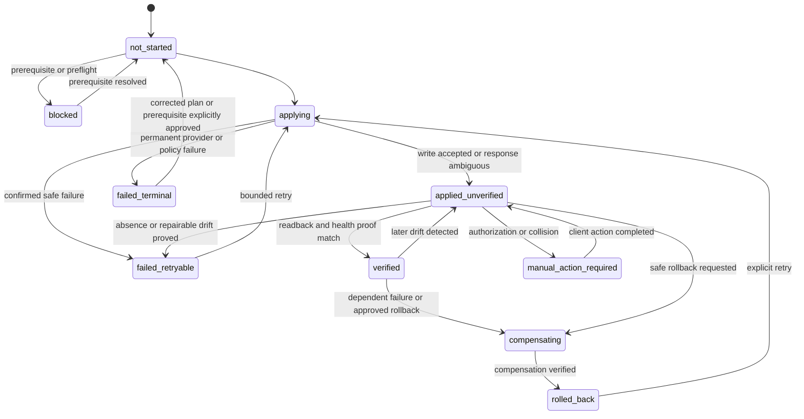

# Guided per-client provisioning and operator CLI

- **Status:** Proposed implementation design
- **Date:** 2026-07-26
- **Issue:** [#20](https://github.com/Humber-Foundry/foundry-cms/issues/20)

## Outcome

One guided, resumable operator flow creates one Foundry CMS installation in a
client's GitHub and Cloudflare accounts, proves every dependency, transfers
ordinary administration to the client and removes any temporary product
maintainer access.

There is no central Foundry control plane. After handoff:

- the client owns the repository, Cloudflare resources, provider accounts,
  billing, data, recovery paths and runtime credentials;
- builds, publishing, schedules, forms, analytics, notifications and MCP
  continue without a Humber Foundry service or credential;
- the public Foundry packages and release metadata are inputs to builds and
  upgrades, not runtime authorities; and
- a client administrator can resume, diagnose, recover and upgrade the
  installation with the public operator CLI.

This design implements the boundaries already accepted in
[ADR-0001](../decisions/ADR-0001-default-form-handling-adapter.md),
[ADR-0002](../decisions/ADR-0002-default-newsletter-delivery-adapter.md),
[ADR-0003](../decisions/ADR-0003-unified-privacy-first-analytics.md),
[ADR-0004](../decisions/ADR-0004-draft-preview-publish-pipeline.md) and
[ADR-0005](../decisions/ADR-0005-human-authentication-authorization-boundary.md).
It does not replace those domain decisions.

### Document structure and authority

This is one lifecycle contract because issue #20 requires resources, steps,
credentials, failure behavior and verification to be reviewed as one
provisioning boundary. Each fact has one authoritative section:

- **Resource inventory** owns what exists, who owns it and its health proof.
- **Create and resume** owns ordering and reconciliation.
- **Operator CLI** owns commands and output; it does not redefine resources.
- **Failure and rollback** owns compensation.
- **Upgrades** and **temporary development** own their distinct transitions.
- **End-to-end verification** is the executable assertion view of the resource
  health proofs, while acceptance traceability is only an issue index.

Domain behavior is linked to the existing ADRs instead of duplicated here.
When a platform resource changes, its inventory row and matching verification
assertion must change together.

## Provisioning invariants

1. **The client's accounts are the authority.** A successful API response,
   local state file, log line or operator report is not proof that a resource
   exists. Every step reads the client account back and verifies the intended
   state.
2. **Create is reconciliation.** Each step has `inspect`, `plan`, `apply`,
   `verify` and, where safe, `compensate` behavior. Resume always inspects
   before it writes.
3. **Names alone do not prove ownership.** Every installation has an immutable
   UUIDv7 `installationId`. A matching name may be adopted only when an
   installation marker or exact recorded provider ID also matches, or when the
   pre-recorded create-intent protocol below proves that this operation created
   the resource. Every other unmarked collision stops for human review.
4. **No blind retry after an ambiguous write.** A timeout moves the step to
   `applied_unverified`. The next action reconciles by provider ID,
   installation marker and configuration fingerprint before another write.
5. **Secrets never become state.** The journal records a logical credential
   slot, provider, health and rotation time, never the value, prefix, suffix or
   request that carried it.
6. **No secret crosses stdout.** Interactive secrets enter through an
   operating-system browser authorization or hidden standard input. They are
   never accepted in a command-line argument, JSON file, environment dump,
   repository, D1 row, report, URL or log.
7. **Production is fail-closed.** Missing Access protection, secret bindings,
   branch enforcement, migration state, health checks or client ownership
   blocks handoff.
8. **Rollback cannot destroy client data.** Automatic compensation can disable
   a route, pause a trigger, revoke a newly created credential or quarantine an
   empty resource. It cannot delete a repository, database, bucket, provider
   account, subscriber record or production DNS record. Destructive cleanup is
   a separate, explicit client action after evidence and backup.
9. **The CLI is not a CMS superuser.** It may create infrastructure, install
   schema migrations, seed a new repository before first Owner activation and
   invoke narrow recovery. It cannot edit an ordinary content item, approve a
   preview, publish, activate a schedule, reveal subscribers or send a
   campaign.
10. **A handoff report is a claim until verified.** `foundry verify --profile
    handoff` must pass from client-controlled credentials after temporary
    maintainer access is removed.

## Installation identity and durable records

### Identity and naming

`foundry scaffold` creates:

```text
installationId = UUIDv7 for the logical site across reprovisioning
deploymentId = UUIDv7 for one account-bound Cloudflare resource set
installationSlug = client label normalized to [a-z0-9-], repeated/edge hyphens removed,
                   capped at 32 characters, or "site" when no ASCII alphanumeric remains
resourceSuffix = first 16 lowercase base32 characters of SHA-256(canonical deploymentId)
resourceStem = <slug>-<resourceSuffix>
operationId = UUIDv7 for each CLI invocation
```

Cloudflare names use `resourceStem`; the chosen GitHub repository name may be
friendlier. Hashing the complete deployment ID preserves random UUIDv7 input in
the 80-bit suffix instead of using its timestamp-dominated prefix. The
repository is created with a description marker containing
`[foundry-installation:<installationId>]` so an interrupted creation can be
distinguished from a pre-existing name collision before its first commit.

`installationId` never changes and joins Git history, content, audit and
handoff evidence for the logical site. `deploymentId` changes only when a
separate Cloudflare resource set is intentionally created, such as a
temporary-to-client reprovision or recovery cutover. The repository bootstrap
manifest records `activeDeploymentId` plus superseded deployment IDs; every D1
resource marker contains both IDs. Resource discovery and create-intent
adoption always match both the logical installation and account-bound
deployment.

### Four client-owned records

| Record | Location | Purpose | Secret content |
|---|---|---|---|
| Bootstrap manifest | `.foundry/installation.json` in the client repository | Lets a fresh machine identify the installation, pinned foundation release, production branch, account-scope fingerprint, deterministic resource names and canonical hostname | None |
| Provisioning state branch | Append-only `.foundry/operations/` receipts on `foundry/provisioning-state` in the client repository | Durable pre-create intents and recovery receipts that remain writable without bypassing production workflow rules | None |
| Provisioning journal | `provisioning_steps`, `provisioning_resources` and `credential_slots` in the installation's D1 database | Full step state, provider IDs, configuration fingerprints, verification evidence and safe credential health | None |
| Encrypted handoff report | Private client-owned R2 bucket, with an optional client-downloaded copy | Ownership, billing, recovery, verification, migration and support-access evidence | No credential value; envelope-encrypted to the client's recovery recipient |

Before D1 exists, the bootstrap manifest plus provisioning-state branch are the
journal. Once D1 is created, the CLI imports the earlier step receipts into D1.
The local `.foundry/operator-cache` is only a convenience and is ignored by
Git; losing it never prevents resume.

The CLI creates `foundry/provisioning-state` before production rules are
enabled. Client-authenticated operator GitHub authorization—not the runtime
publisher App—appends create intents and receipts with non-force,
compare-and-swap commits. The production pull-request workflow ruleset does not
target this state branch; the non-bypassable force-push/deletion safety ruleset
does. Each receipt includes the previous receipt hash and is signed by a
dedicated client-held provisioning receipt key whose public key is anchored in
the initial bootstrap manifest. Resume traverses and verifies the complete
hash/signature chain from the branch root; an unsigned commit, missing link,
tree deletion or unexpected signer blocks import into D1. A fresh operator
reauthorizes to the client repository and supplies the client-held signing key
through hidden input before writing, so ordinary repository write access cannot
forge journal authority and no maintainer credential is retained.

Before any provider create that cannot accept an idempotency key or installation
tag, the CLI commits a create intent to the client repository's provisioning
state branch. It contains the provider, exact collision-resistant name,
operation ID, desired fingerprint, installation ID, deployment ID, a one-way
account-scope fingerprint and `notBefore` time. Preflight must have proved that
name absent. The fingerprint is computed from provider, account ID,
installation ID and deployment ID; a fresh operator re-authenticates,
enumerates only accounts they may access and recomputes it. The raw provider
account ID is not committed.
After an ambiguous response, resume may automatically adopt one unmarked
candidate only when the provider exposes a create audit/request identity that
conclusively binds that resource to this operation's committed nonce and all of
these corroborating facts also hold:

- the repository intent is committed on the expected client repository;
- the account and exact name match;
- the provider reports exactly one candidate;
- its provider creation time is at or after `notBefore` and within the bounded
  operation window;
- its configuration is empty or matches the intended fingerprint; and
- no later conflicting create intent exists.

Name, time and configuration correlation alone never prove ownership. When the
provider cannot supply the conclusive request binding—or any corroborating fact
is unavailable or mismatched—the CLI records the candidate as
`ambiguous_resource` and stops for one of two explicit resolution transitions.
Only a conclusively bound automatic adoption or the verified-adoption
transition below may write and verify the installation marker before dependent
steps run.

1. **Verified adoption:** `diagnose --repair-plan` records the provider ID and
   conflicting/missing fact. A client account administrator supplies the
   missing provider evidence and completes fresh interactive provider
   authentication. The resolution file is a non-authoritative plan containing
   a 15-minute, one-use nonce and the committed repair-plan hash; it carries no
   reusable authorization. `deploy --resume --resolution-file <path>` requires
   the live provider to confirm that the authenticated principal is an
   administrator of the fingerprinted account, rechecks ownership, creation
   time, configuration and absence of a competing intent, and consumes the
   nonce with a compare-and-swap journal/repository receipt before writing the
   marker and advancing to `applied_unverified`. A changed, expired or replayed
   plan is rejected.
2. **Quarantine and supersede:** when ownership cannot be proved, the client
   administrator disables or quarantines the candidate where the provider
   permits and records its provider ID and recovery owner. A new
   `deploymentId`/resource stem may be approved directly only when no other
   resource for the old deployment has advanced beyond a committed create
   intent. Otherwise the repair plan is a whole-deployment reprovision: it
   inventories and write-fences every old-deployment resource, checkpoints any
   D1/R2 data that already exists, and records a signed supersession intent
   linking the old and new deployment IDs before creating anything under the
   new stem. Resume then recreates, imports where necessary and verifies the
   complete resource inventory under the new deployment; it never reuses an
   old-deployment binding in the new set. Only after every required new resource
   is verified does a compare-and-swap manifest commit change
   `activeDeploymentId`, append the old ID to the superseded list and anchor
   cross-linked receipts in both the provisioning-state branch and new D1
   journal. The old set remains fenced and non-serving, and each resource is
   marked `quarantined` or `superseded` and retained in the handoff report until
   its owner explicitly resolves it. A failure before the manifest commit
   leaves the old active pointer unchanged and both sets fenced; resume
   reconciles both inventories from the signed supersession receipt rather than
   continuing with a mixed deployment.

Neither transition creates another resource under the ambiguous identity,
silently adopts it, or leaves it unrecorded.

The bootstrap manifest contains only operational identifiers that are already
visible to administrators of the client accounts. The scaffold warns before
putting these identifiers in a public repository. Provider account IDs,
personal email addresses, health response bodies and audit evidence remain in
D1 or the encrypted report.

Each resource record includes:

```text
installationId
deploymentId
provider
resourceKind
providerResourceId
displayName
ownershipPrincipal
createdByOperationId
adopted (boolean)
desiredFingerprint
observedFingerprint
lastVerifiedAt
lifecycle: active | disabled | quarantined | superseded
```

Each step record includes its input hash, prerequisites, status, attempt count,
safe provider request ID, timestamps, last stable error code and the exact
verification checks that passed. Raw provider responses are neither required
nor retained.

## Resource inventory and ownership

### GitHub

| Resource | Created/configured by | Production owner | Recorded identifier | Health proof | Recovery authority |
|---|---|---|---|---|---|
| Site repository and production branch | Temporary authenticated client GitHub session | Client user or organization | Repository node/REST ID, owner/name and branch | Fetch repository, branch head and installation marker | Client repository/org owner |
| Scaffold and exact package pins | Operator CLI from a signed public Foundry release | Client | Foundation version, npm integrity and scaffold schema | Lockfile install, typecheck, build and integrity check | Client can rerun scaffold/upgrade from public release |
| Production branch safety and workflow rulesets | Temporary client repository administration session | Client | Both ruleset IDs and policy fingerprints | Read back active enforcement; prove force push/deletion denied to every actor, human direct push denied and publisher compare-and-swap update allowed | Client repository/org owner |
| Site publisher GitHub App | GitHub App Manifest flow authorized by client | Client | App ID, installation ID and repository selection | Mint repository-limited one-hour token; read metadata/checks; perform a non-production canary commit or dry transaction | Client GitHub App manager |
| Upgrade-gate GitHub App | GitHub App Manifest flow authorized by client; one private key held only in offline client recovery custody | Client | App ID, installation ID, repository selection and public key fingerprint | From a fresh client machine, supply the offline key through hidden input, mint a repository-limited token, write/read a check on a sacrificial commit and revoke the token | Client GitHub App manager and named offline-key custodian |
| Cloudflare Workers Git integration | Client authorizes Cloudflare's GitHub App once | Client | GitHub installation and Cloudflare repository-connection IDs | Read connection and trigger; build exact canary commit | Client GitHub and Cloudflare administrators |

The publisher App is installed for only the site repository and requests only
metadata read, contents read/write, checks read and commit-status read, as
required by ADR-0004. Repository administration is used only by the temporary
interactive provisioning session to create the rulesets; it is not granted to
the runtime publisher.

The separate upgrade-gate App is installed only on the site repository and has
metadata read and Checks write, with no contents, administration or
pull-request write authority. Its sole private key is not a runtime secret and
is never retained by Humber Foundry or the installation. The client takes it
into the same offline recovery custody used for the provisioning receipt key;
only its public fingerprint is recorded. During each upgrade, a fresh client
machine supplies the key through hidden input, the CLI exchanges it for a
repository-limited one-hour installation token, writes and verifies the
SHA-bound `foundry-upgrade-ready` check, revokes that token through GitHub's API
and clears the private key from memory. GitHub App private-key deletion remains
an explicit client App-manager rotation/recovery ceremony because GitHub does
not expose it to the CLI and does not permit deletion of an App's sole key. The
client user's separately authenticated repository session performs the
conditional merge. Thus neither the publisher runtime nor an ordinary user
token can manufacture the upgrade check.

The two protected branches use two rulesets. A non-bypassable safety ruleset
blocks force pushes and branch deletion on production and
`foundry/provisioning-state` for every actor, including the publisher App. A
separate production-only workflow ruleset requires pull requests and required
checks for human code changes and grants a narrowly named `always` bypass to
the publisher App only for its compare-and-swap content commits. Provisioning
verifies both policies and proves that the App can update the expected
production head but cannot force push or delete either branch. If the client's
GitHub plan and repository visibility cannot enforce both policies, preflight
blocks production rather than silently weakening them.

### Cloudflare

| Resource | Purpose and binding | Production owner | Health proof | Recovery authority |
|---|---|---|---|---|
| One Worker/Next deployment | Public renderer, `/dash`, application API, preview, MCP endpoint, scheduler and provider callbacks | Client Cloudflare account | Public release marker, protected-route probes and Worker deployment/version API | Client Cloudflare administrator |
| One D1 database | Drafts, users, audit, forms/outbox, consent/suppression, schedules, operations, aggregates, provisioning journal and isolated cutover inbox | Client | Schema ledger, transactional read/write canary, migration checksum, cutover-inbox append/dedup/replay canary and point-in-time recovery availability | Client Cloudflare administrator plus CLI migration/recovery |
| One private R2 bucket | Media plus encrypted D1/export backups under separate prefixes | Client | Put/read/delete a synthetic non-personal object; verify private access and lifecycle rules | Client Cloudflare administrator |
| One Analytics Engine dataset binding | Allowlisted anonymous interaction aggregates only | Client | Synthetic allowlisted event and bounded aggregate query | Client Cloudflare administrator |
| One Web Analytics site | Privacy-first page/content source for the canonical hostname | Client | Site/hostname enabled and a source query succeeds after propagation | Client Cloudflare/zone administrator |
| One Turnstile widget | Public form abuse control, restricted to configured hostnames/actions | Client | Server-side synthetic validation and rejected wrong-host/action tests | Client Cloudflare administrator |
| One Access application and exact-email policy | Protect `/dash`, CMS API and canonical previews with one audience | Client | Direct route matrix, valid login, invalid/unknown identity denials and policy readback | Client Zero Trust administrator |
| One production custom domain/route and DNS state | Canonical public and protected hostname | Client | Authoritative DNS, TLS, route and uncached release-marker checks | Client zone/DNS administrator |
| Worker Cron triggers | Shared due-work claim, outbox delivery, provider reconciliation, analytics projection, backup and retention jobs | Client | Each job writes a bounded heartbeat and last synthetic result to D1 | Client Cloudflare administrator |
| Email notification binding and verified destinations | Fixed staff form notifications behind `DeliveryAdapter` | Client | Quiet synthetic outbox path plus an explicitly requested real destination test | Client Cloudflare/email administrator |
| Workers Builds repository connection, production trigger and build token | Build and deploy the production branch | Client | Build canary commit, matching check/status and release marker | Client Cloudflare administrator and nominated client build-token owner |

The default creates **no Cloudflare Queue**. ADR-0001 selected the D1
transactional outbox and shared scheduler. A future queue adapter must appear
as an optional resource with its own receipt and health check; its absence is
healthy for the default installation.

`workers.dev` and version preview URLs are disabled for production unless the
same Access audience and policy protects their private namespaces. The default
is to disable both and use only the canonical hostname.

The R2 bucket is private. Media and backups use distinct binding prefixes.
Backup objects are application-encrypted to a client-controlled asymmetric
recovery recipient and the backup prefix has a verified 30-day deletion
lifecycle. Media follows its separately defined retention rules and is never
swept by the backup lifecycle.

### External delivery providers

| Resource | Production owner | Secret location | Health proof | Recovery authority |
|---|---|---|---|---|
| Brevo account, sending domain, sender identities, list/audience mapping and webhooks | Client | Client-owned Worker secret for API key; webhook verification secret where supported | ADR-0002 site-specific account checks plus pinned signed release evidence for second-adapter migration; credential, sender/domain, test delivery, webhook and reconciliation proofs | Client Brevo administrator |
| Staff notification configuration | Client | Destination and transport configuration in protected D1/Worker configuration; provider credentials in Worker secrets | Synthetic delivery; a provider-verified real-destination receipt is additionally required for `full`, `pre-handoff` and `handoff` | Client email/provider administrator |

No provider password is requested. The client creates or authorizes the narrow
provider credential and enters it through hidden standard input. Provider setup
is not complete until ownership, billing, sender/domain recovery and credential
rotation are recorded.

The ADR-0002 production-readiness gate has two evidence scopes. Credential,
sender/domain, subscriber, campaign, webhook, reporting and export checks run
against this client's Brevo account. Migration-to-a-second-adapter conformance
is release evidence tied to the exact pinned adapter versions, supplemented by
a provider-neutral export/import check on the site; it does not create an
undeclared second provider account for every client.

### Authentication, analytics and application secrets

Runtime secrets are separate least-privilege slots:

| Slot | Minimum authority | Created by | Rotation verification |
|---|---|---|---|
| `github_publisher_private_key` | Site publisher App only | GitHub App Manifest ceremony | Mint scoped installation token, then rotate and retest |
| `cloudflare_access_sync_token` | This account's Access apps/policies write | Client or temporary token-factory ceremony | Reconcile exact-email policy, revoke old token, observe degraded health, install replacement |
| `cloudflare_analytics_read_token` | Account Analytics read for named account/zones | Client or temporary token-factory ceremony | Query safe aggregate source, revoke and replace |
| `turnstile_secret` | One widget verification secret | Turnstile creation response | Rotate widget secret and repeat synthetic validation |
| `brevo_api_key` | Required client account capabilities only | Client Brevo administrator | Run provider health and test-send acceptance steps |
| `brevo_webhook_verification_secret` | Verify only this installation's Brevo callbacks, where the configured webhook mode provides a shared secret | Client Brevo administrator or provider creation response | Reject invalid callback, accept signed canary, rotate and repeat |
| `staff_notification_transport_secret` | Only the selected notification adapter and fixed destinations | Client notification-provider administrator; `not_required` for a secretless Cloudflare Email binding | Synthetic and real receipt after rotation, or verified binding proof when no secret exists |
| `mcp_oauth_signing_key` | Sign access tokens for this installation's MCP authorization server only | Generated locally in memory; private key written to a Worker secret and public key exposed through the installation JWKS | Publish old/new public keys during bounded overlap, verify tokens from both, switch issuance, expire old tokens and remove the old key |
| `csrf_signing_key` | No external authority | Generated locally in memory | Deploy replacement with bounded overlap; reject old token after overlap |
| `backup_recovery_recipient` | Public encryption key only; no external API authority | Client supplies or generates a public/private recovery pair | Encrypt canary in runtime, then decrypt from a fresh machine with the client-held private key |

The non-runtime `provisioning_receipt_signing_key` is generated locally and its
private half is delivered to the same client-controlled recovery custody as the
backup key; only its public verification key enters Git/D1. Rotation appends a
cross-signed key-transition receipt, verifies a new-key canary and revokes use
of the old key after the bounded overlap. Lost-key recovery requires client
repository and Cloudflare administrator authorization and records a new trust
anchor in both the bootstrap manifest and D1; it never silently accepts an
unsigned branch.

Where compatible, runtime Cloudflare tokens should be account-owned rather than
tied to a person. Current Workers Builds configuration still uses a
client-owned user token; the handoff report therefore names the client's build
token owner and rotation/recovery procedure. A product-maintainer user token is
never accepted as the production build token.

The temporary provisioning token is a client-created, account- and
zone-restricted user token with a short expiry. A separate short-lived token
factory authorization may create the two runtime account tokens. The token
factory receives only token-creation authority; the provisioning token does not
receive it. If the client does not allow programmatic token creation, the CLI
emits prefilled Cloudflare token-template URLs and pauses while the client
creates each runtime token. Turnstile provisioning uses a compatible
client-owned user token because account-owned token support is not currently
available for Turnstile.

Every adapter package declares its logical credential slots in the non-secret
feature manifest. Deploy fails if a declared secret has no `credential_slots`
row, ownership principal, health check and rotation procedure. A secretless
binding records `not_required` plus the verified binding fingerprint; omitting a
slot is never used to mean “probably configured.”

Every temporary authorization is verified, used, and allowed to expire or is
revoked before handoff. Retaining the operator's browser or CLI login is not a
handoff mechanism.

Backups use envelope encryption. The Worker stores the client's public recovery
recipient and can encrypt a fresh random data key for each object; it never
needs the recovery private key. The client keeps that private key outside
Cloudflare in its chosen password manager or offline recovery custody. If the
CLI generates the pair, it writes the private recovery bundle directly to a
client-selected protected destination, never stdout or the repository, and
retains no copy. Handoff blocks until a fresh client machine supplies the key
through hidden input, decrypts a synthetic canary and an encrypted report, and
the report names the client custodian and replacement procedure. A lost Worker
or all revoked Worker secrets therefore does not destroy the recovery path.

### Human action budget

Every client pause is emitted as a typed `action.required` event and is one of
these explicit authorization, ownership-review or DNS ceremonies. Initial
create and handoff use only the account, credential, recovery, Owner,
provider/DNS and revocation rows; the final review rows apply only when a later
upgrade, recovery or ambiguity actually occurs.

| Action | Why the client must act |
|---|---|
| Authorize the selected GitHub owner and Cloudflare account | The CLI cannot choose or impersonate the client's account authority |
| Approve the site publisher App, upgrade-gate App and Cloudflare GitHub integration | GitHub requires the repository/app owner to grant access |
| Create/approve narrow Cloudflare and provider credentials | Their one-time values and billing authority belong to the client |
| Take custody of and prove the backup recovery, provisioning-receipt and offline upgrade-gate App private keys | Only the client may retain decryption, durable journal-signing and upgrade-check authority used after total runtime loss |
| Verify first Owner login/MFA and authorize the synthetic publish canary | A human identity must claim its own account, and only a CMS-authorized human may approve the normal publication path |
| Verify Brevo sender/domain and staff notification destination | The account/domain owner must prove delivery authority; DNS records are created automatically when authorized or emitted as exact manual DNS actions |
| Move the canonical hostname's authoritative zone to the client Cloudflare account when it is external | An ordinary Worker custom domain/route requires an active Cloudflare-managed zone; the current DNS owner must approve nameserver/delegation changes |
| Revoke temporary maintainer account grants at handoff | Only the client account owner can conclusively remove another principal |
| Review an upgrade or contract pull request, supply the offline upgrade-gate App key and authorize the guarded CLI merge | Only the client repository authority and offline-key custodian may accept reviewed foundation/code changes and enable a SHA-bound check; the CLI performs the conditional merge only after a fresh plan recheck, then revokes the installation token and clears the key from memory |
| Approve verified adoption, quarantine or a superseding deployment | Ambiguous provider ownership and irreversible collision choices require the client infrastructure owner |
| Approve an existing-repository adoption and integration pull request | Only the client repository owner can confirm that an existing repository should receive the Foundry scaffold |
| Rebind human identities during cross-account reprovisioning | A target Access application has a new issuer/audience, so each human must prove and bind their own target identity under Owner control |
| Approve a migration cutover, rollback or destructive contract phase | Only the client may authorize a bounded service transition or retirement of backward compatibility |

Provider/API health receipts replace subjective “I received it” confirmations.
Any other required client task is an automation gap: provisioning records it as
a release-blocking defect rather than adding an undocumented manual step.

## Step state machine

### Per-step states



`applying` is never persisted as evidence of success. On process restart it is
treated as `applied_unverified`. `failed_terminal` records the stable provider
or policy reason and never retries automatically; only a newly reviewed plan or
an explicitly corrected prerequisite can return it to `not_started`.

### Derived installation phases

The installation phase is derived from verified steps, not independently
edited:

```text
discovered
  -> preflight_ready
  -> repository_ready
  -> cloudflare_resources_ready
  -> runtime_bound
  -> access_ready
  -> owner_claimable
  -> owner_active
  -> deployment_ready
  -> verification_ready
  -> handoff_ready
  -> handed_off
```

A later failed health check changes `handed_off` to `degraded`; it does not
erase the historical handoff evidence.

### Command workflow state machines

The generic step states above govern every provider mutation. These command
states define the requested end-to-end workflows:

| Flow | Ordered states | Failure/resume transition | Verified terminal state |
|---|---|---|---|
| Create | `planned -> preflighted -> repository_ready -> resources_ready -> runtime_bound -> access_ready -> owner_claimable -> owner_active -> deployment_ready -> verification_ready` | Any write enters `applied_unverified`; resume reconciles the current state before continuing | `verification_ready` |
| Resume | `manifest_loaded -> journal_reconciled -> providers_reconciled -> next_step_selected -> executing` | `foreign` or `ambiguous` enters `manual_review`, then either `verified_adoption -> applied_unverified` or `quarantined -> supersession_intent_committed -> old_set_fenced -> new_set_reprovisioning -> new_set_verified -> manifest_cutover -> superseded_deployment`; retryable absence/drift returns to the relevant step's `applying` state | The interrupted flow's terminal state |
| Verify | `profile_loaded -> checks_planned -> synthetic_checks_running -> external_checks_running -> evidence_committed` | A critical failure ends `failed`; only non-handoff profiles may permit a named non-critical source to end `degraded`; rerun creates a new evidence revision | `passed`; `candidate_ready` for `pre-handoff`; or explicitly permitted `degraded` outside handoff |
| Hand off | `candidate -> access_inventory_confirmed -> temporary_access_revoked -> post_removal_verifying -> report_sealed` | Any failed post-removal check returns to `candidate`; it never restores access implicitly | `handed_off` |
| Upgrade | `planned -> backup_verified -> review_branch_ready -> temporary_gate_active -> client_approved -> content_reconciled -> publisher_fenced -> exact_head_checked -> merged -> expand_deployed -> publisher_unfenced -> backfill_complete -> expand_verified -> ordinary_rules_restored -> contract_gate_active -> contract_merged -> contract_deployed -> contract_activated -> contract_verified -> ordinary_rules_restored -> upgrade_verifying` | Before contract activation, deploy the prior compatible version; an abort or crash while a temporary gate is active leaves human merges blocked until the plan-bound restoration transition completes; after data change, pause and forward-repair or restore into a new database and explicitly cut over | `upgraded` |
| Diagnose | `scope_loaded -> observations_collected -> drift_classified -> causes_ranked -> report_ready` | Missing authority/source ends `blocked_with_evidence`; diagnosis never mutates or advances a provisioning step | `diagnosed`, optionally `repair_plan_ready` |

Only `deploy` or `migrate` can execute a repair plan. A diagnostic result cannot
transition a resource directly from drifted to verified.

## Create and resume flow

### 1. Discover and preflight

The operator selects or creates the client GitHub owner, Cloudflare account,
zone/hostname, repository visibility, installation label, first Owner email,
notification destinations, data jurisdiction and provider plan.

Preflight is read-only and proves:

- the authenticated GitHub and Cloudflare principals are client-controlled;
- a requested new repository name is absent; or a planned existing-repository
  adoption resolves to the exact client-owned repository ID, administrator
  authority and no conflicting Foundry installation marker; all unrelated
  repository, resource and hostname name matches are collisions;
- the GitHub plan can enforce separate non-bypassable safety and App-bypass
  workflow rulesets and a temporary production ruleset whose required check is
  bound to the recorded upgrade-gate App integration;
- GitHub Actions is enabled for the selected owner/repository, the organization's
  allowed-actions and workflow policies admit every pinned scaffold action, and
  the operator can observe required-check conclusions;
- the Cloudflare account and zone expose the required Workers, D1, R2,
  Analytics Engine, Web Analytics, Turnstile, Access, DNS, Builds and email
  capabilities;
- current quotas leave a safe margin, with warnings at 70% and a block at or
  above 90% unless the client accepts and records a paid-capacity plan;
- the canonical hostname and Access team domain are known;
- the selected foundation release, package integrity and required migration
  chain verify; and
- no maintainer-owned credential or runtime endpoint appears in the desired
  production configuration.

The result is a reviewable plan. `foundry deploy` requires the plan input hash;
changing account, hostname, release or region invalidates approval of the plan.

### 2. Create and scaffold the client repository

For a new repository, the CLI creates it in the client-selected owner with the
installation marker in its description, then writes one initial scaffold
commit. For a planned adoption, it re-verifies the authenticated client's
administrator authority and immutable repository ID, rejects a marker for any
other installation, and proposes the description marker and scaffold as a
normal integration pull request against the selected branch. It preserves all
existing content and rules. After client merge, the same authenticated
repository administrator updates the repository description marker through the
GitHub API and the CLI reads back the immutable repository ID plus marker;
neither the pull request nor a file commit is claimed to change repository
metadata. Both the merge and verified metadata update form the adoption
receipt.

The scaffold contains:

- the typed browser-safe and server-only Site Definition seams;
- the registered renderers and empty production content collections;
- thin `/dash`, API and preview mounts;
- exact Foundry package versions and lockfile integrity;
- Wrangler bindings with resource names but no secret values;
- disabled `workers.dev` and preview URLs for production;
- database migrations and fixture-free schema checks;
- build, typecheck, test, security and repository-integrity workflows;
- the public-safe bootstrap manifest; and
- a generated ownership/readiness checklist.

It also creates `foundry/provisioning-state` with its installation-bound initial
receipt. All later writes to that branch use client operator authorization and
compare-and-swap commits; it is never a content publication path.

Before deriving `repository_ready` or enabling required rules, the CLI runs the
actual scaffold required-check workflow on the initial/adoption commit and
reads back a successful check suite. A disabled workflow, disallowed action or
missing check blocks provisioning rather than installing an unsatisfiable
ruleset.

The production scaffold contains empty content collections and schema-valid
fixtures used only by tests. It does not create starter editorial content. When
adopting an existing repository, `scaffold` adds the CMS integration without
changing existing content files.

Initial and later content imports go through an Owner-authenticated application
import command after first Owner activation. The command creates a D1 draft and
ordinary canonical preview; the Owner must approve and publish it through the
same Git path as any other edit. `scaffold` and `migrate` cannot write or
transform editorial content in Git or D1.

### 3. Create storage and deploy a bootstrap runtime

Using deterministic names, the CLI creates D1, private R2 and lifecycle rules,
then applies the bootstrap schema transactionally. It writes the installation
marker and imports pre-D1 receipts into the provisioning journal.

It creates Analytics Engine and Turnstile bindings, generates local-only
application secrets in memory, deploys a bootstrap Worker with no public
production route and uploads secrets directly to Worker secret storage. The
bootstrap runtime exposes only authenticated provisioning health and the
one-use first-Owner claim seam; CMS domain commands remain unavailable.

If secret upload is interrupted:

- a readable provider ID is reconciled;
- the logical slot remains `missing` or `unverified`;
- the value is requested or generated again through hidden input; and
- a previously created external credential is rotated or revoked before the
  replacement is accepted.

The CLI never attempts to recover a secret value from logs or state.

### 4. Create the client publisher and branch policy

The client completes the GitHub App Manifest authorization. The returned
private key remains in process memory only long enough to upload it to the
Worker secret slot. The CLI installs the App on only the site repository and
records the App and installation IDs.

In a separate Manifest ceremony, the client creates the upgrade-gate App with
only metadata read and Checks write, installs it on the same one repository,
and records its App/integration and installation IDs plus public key
fingerprint. The CLI writes and reads a check on a sacrificial commit and
revokes the resulting installation token. The client then takes the App's sole
private key into offline recovery custody; handoff requires a fresh client
machine to supply it through hidden input, repeat the canary and prove that no
runtime or maintainer store contains it.

If the process dies between App creation and secret upload, resume reports an
incomplete key ceremony. The client App manager generates a replacement key
through GitHub's settings flow, enters it through hidden input and revokes the
unused key. Provisioning does not claim that an inaccessible private key is
recoverable.

The temporary GitHub administrator then creates both production rulesets. Their
targets include a sacrificial `foundry/policy-canary/<operationId>` ref with the
same effective safety/workflow rules. Only on that ref, canaries prove the
publisher can make a non-force compare-and-swap update while an ordinary direct
human push, an App force push and an App branch deletion are rejected. If a
destructive request unexpectedly succeeds, provisioning blocks but no
production or provisioning-state history is lost. The CLI verifies the real
production and provisioning-state branches only through non-destructive
ruleset target/enforcement readback, then removes a healthy sacrificial ref
through the explicit administrator cleanup path.

### 5. Configure the canonical route, Access and first Owner

While the bootstrap Worker still has no public route, the CLI configures the
canonical DNS/custom-domain intent and creates one Access application and one
audience for the three protected path families in ADR-0005. The standard v1
path requires the canonical hostname to belong to an active zone in the
client's Cloudflare account. If it is externally authoritative, the CLI emits
the exact nameserver or delegated-zone action as `manual_action_required` and
blocks until Cloudflare reports the zone active; a plain external CNAME is not
treated as sufficient to bind the Worker. Partial zones or Cloudflare for SaaS
are out of the default v1 inventory and require a future explicit adapter with
its own plan, resources and health proofs.

It creates the exact-email policy using the first Owner email and configured
OTP or client IdP, sets the starting session policy, enables the binding cookie
where compatible and verifies that no Bypass, Everyone or domain-wide rule
exists. Only after DNS, Access application and policy readback pass does it
enable the Worker route. It immediately proves that protected paths are gated
and public paths expose only the bootstrap placeholder. Provider integration
callbacks are tested separately: the unauthenticated Brevo callback must reach
the Worker and return its bearer-authentication `401`, while the CMS API
continues to return an Access challenge. There is no interval in
which the claim seam is publicly reachable without Access.

It stores the first Owner as a one-use D1 bootstrap invitation only after the
Access policy readback matches. The installer signs in through Access and
claims it. A D1 transaction creates the identity binding and Owner membership,
writes audit evidence and permanently closes bootstrap mode.

Provisioning strongly prompts for a second Owner and optional independent MFA,
but records rather than conceals a client's decision to defer them.

### 6. Configure provider and notification adapters

The client supplies the Brevo credential and completes sender/domain
verification. The CLI configures safe provider mappings and verified webhook
URLs, then runs the ADR-0002 acceptance gate in a client-owned account before
the first production send.

The client confirms fixed staff notification destinations. The quiet synthetic
form path tests validation, Turnstile, D1 transaction, outbox claim and adapter
processing without notifying production recipients. A separate, explicit
operator action sends one real notification and records only its safe receipt.

### 7. Connect builds, promote the runtime and enable analytics

The client authorizes Cloudflare's GitHub integration for only the site
repository. The CLI then uses the Builds API to create the repository
connection, production trigger, environment configuration and first build.
The Worker name in the scaffold and Cloudflare must match.

After the build succeeds, the CLI promotes the verified production deployment
on the already Access-fronted canonical route. It does not claim success from a
screenshot or client confirmation alone.

The CLI creates or adopts the canonical hostname through Cloudflare's RUM Site
Info API using the short-lived provisioning token's `Account Settings Write`
authority. It records the site tag/token as non-secret configuration, enables
automatic injection for the proxied hostname where supported, verifies beacon
delivery and proves an account-scoped aggregate query. Analytics Engine and
provider projectors then write source-labelled aggregate facts to D1. The CLI
disables public Worker and version-preview aliases, then probes every public and
protected namespace through the canonical hostname.

### 8. Verify and hand off

`foundry verify --profile pre-handoff --plan` first writes a reviewed candidate
verification plan. `foundry verify --profile pre-handoff --plan-file <path>`
runs the end-to-end checklist below and writes a `candidate_ready` report with
access removal, post-removal credential rotation and every canary/recovery check
that depends on either action marked `post_removal`/`pending_action`. Guided
`action.required` account-revocation ceremonies then remove any temporary
maintainer GitHub collaboration, Cloudflare membership, Access membership,
provider role and unexpired provisioning credential.

Using client-controlled authorization, the client first runs
`foundry diagnose --check credential-rotation --repair-plan` and executes the
reviewed result with `foundry deploy --plan-file <path>`, supplying replacement
values through hidden input or provider authorization. This rotates the
publisher, Access-sync, analytics, Turnstile, MCP OAuth signing key and
configured provider credentials and records functional receipts. The client
then generates a fresh
post-removal plan with `foundry verify --profile handoff --plan` and executes it
with `foundry verify --profile handoff --plan-file <path>`. Only that second
report, which verifies the replacement receipts, can set `handed_off`.

The report names:

- the client owner and recovery authority for every repository, resource,
  provider account, billing relationship and credential slot;
- all remaining human, App and integration access;
- the exact foundation version and migration state;
- the profile-permitted status and evidence time for each health check,
  including `pending_action` only in a candidate report;
- quota and plan state;
- backup and recovery drill status;
- manual actions the client accepted;
- support access, if any, with scope, owner and revocation procedure; and
- the command required to reproduce verification.

## Operator CLI

### Command surface

```text
foundry scaffold [--plan] [--plan-file <path>] [--from-site <path>] [--json]
foundry deploy [--resume] [--plan-file <path>] [--resolution-file <path>] [--json]
foundry migrate [--to <foundation-version>] [--from-installation <manifest>] [--plan] [--plan-file <path>] [--resume] [--json]
foundry verify [--profile smoke|full|pre-handoff|handoff|upgrade] [--plan] [--plan-file <path>] [--json]
foundry diagnose [--check <name>] [--repair-plan] [--json]
```

These are the only v1 top-level commands.

- `scaffold --plan` creates the read-only, input-hash-bound repository plan;
  `scaffold --plan-file <path>` creates or adopts the client repository
  boundary and writes the reviewable site scaffold from that exact plan. The
  resulting receipt lets `deploy --plan-file <path>` continue the same create
  operation. Exactly one of `--plan` or `--plan-file` is required for a new
  create; `--from-site` is an input to either mode. `scaffold` never writes
  editorial content or publishes a CMS draft.
- `deploy` reconciles infrastructure and configuration. `--resume` is the
  ordinary continuation path, not a special recovery mode.
  `--resolution-file` accepts only an installation-bound ambiguity plan
  produced from `diagnose --repair-plan`; live provider-administrator
  authentication authorizes the one-use decision, so the file is not a general
  override or bearer capability.
- `migrate` handles foundation, infrastructure and schema migrations or
  reprovisions an installation into another client account. Cross-account data
  movement may transport all existing client-owned D1/R2 state, including
  editorial records, as a hash-verified byte-for-byte snapshot/delta; it cannot
  author, interpret or transform editorial content or invoke a content command.
  `--plan` creates a reviewed migration plan; `--plan-file` executes that exact
  input-hash-bound plan after rechecking prerequisites, and `--resume`
  continues the same migration operation after a recorded action boundary.
- `verify --profile smoke` is read-only except for explicitly labeled,
  reversible synthetic canaries that clean up through normal application
  transitions and contain no personal data. `full`, `pre-handoff`, `handoff`
  and `upgrade` are explicit verification ceremonies: `--plan` describes every
  proposed side effect and required authority without mutating, and
  `--plan-file` executes only that reviewed, input-hash-bound set. Permitted effects are
  bounded evidence/report writes, synthetic canaries, a restore into a new
  temporary recovery database, and an explicitly addressed provider test
  delivery. Credential rotation and access removal remain `deploy`/`migrate`
  actions whose receipts these profiles verify; `verify` never performs them
  implicitly.
- `diagnose` is read-only. `--repair-plan` proposes commands and compensations;
  it does not mutate. The operator explicitly runs `deploy` or `migrate` with
  the resulting plan.

Owner recovery is a narrow mode of `migrate --from-installation`, matching
ADR-0005. It can repair identity membership and Access synchronization only. It
cannot read or edit content, access subscriber identities, publish or send.

### Machine-readable contract

With `--json`, stdout is UTF-8 newline-delimited JSON and contains no prose.
Human progress and safe diagnostics go to stderr. The first line is a command
envelope, followed by events and one terminal result:

```json
{"schemaVersion":"foundry.operator/v1","event":"command.started","command":"deploy","operationId":"0198...","installationId":"0198...","deploymentId":"0198...","deploymentRole":"target","inputHash":"sha256:...","cliVersion":"1.4.0"}
{"schemaVersion":"foundry.operator/v1","event":"step.changed","installationId":"0198...","deploymentId":"0198...","deploymentRole":"target","stepId":"cloudflare.d1","status":"applied_unverified","attempt":1,"resource":{"kind":"d1","name":"acme-kmnpqrstuvwxyzab"}}
{"schemaVersion":"foundry.operator/v1","event":"action.required","installationId":"0198...","deploymentId":"0198...","deploymentRole":"target","stepId":"cloudflare.builds.authorization","action":{"kind":"browser_authorization","url":"https://dash.cloudflare.com/...","expiresAt":"2026-07-27T01:00:00Z"}}
{"schemaVersion":"foundry.operator/v1","event":"check.completed","installationId":"0198...","deploymentId":"0198...","deploymentRole":"target","checkId":"auth.protected-routes","status":"pass","observedAt":"2026-07-27T00:10:00Z","evidenceRef":"check:auth.protected-routes:7"}
{"schemaVersion":"foundry.operator/v1","event":"command.completed","command":"deploy","operationId":"0198...","installationId":"0198...","deploymentId":"0198...","deploymentRole":"target","status":"needs_action","summary":{"passed":18,"failed":0,"pending":1},"next":{"command":"foundry deploy --resume --json"}}
```

Stable fields:

| Field | Contract |
|---|---|
| `schemaVersion` | Required on every line; breaking output changes require a new major schema |
| `event` | Closed v1 vocabulary: `command.started`, `step.changed`, `action.required`, `check.completed`, `warning`, `command.completed` |
| `operationId` / `installationId` | Opaque stable command and logical-site IDs, never credentials |
| `deploymentId` / `deploymentRole` | Required on each deployment-scoped event; the opaque account-bound resource-set ID and `source` or `target` role |
| `status` | One documented step or terminal status |
| `code` | Stable machine reason; provider prose is redacted and subordinate |
| `evidenceRef` | Opaque pointer to client-owned D1/report evidence, not a secret or raw response |
| `next` | Safe resumable command without credential arguments |

Exit codes:

| Code | Meaning |
|---:|---|
| `0` | Requested terminal state verified |
| `2` | Valid invocation completed with client action required |
| `3` | Retryable provider or network failure |
| `4` | Preflight or policy block |
| `5` | Drift, collision or ambiguous ownership requiring review |
| `6` | Verification failed |
| `7` | Invalid input or incompatible CLI/manifest schema |
| `8` | Security invariant violation; writes stopped |

All output passes a deny-by-default redactor. Fields not explicitly allowed by
the event schema are discarded. Credential-shaped material causes the event to
be discarded in full. The CLI emits a schema-valid `warning` event containing
only `schemaVersion`, `event`, `operationId` and
`code: "security.output_redacted"`, followed by a schema-valid
`command.completed` event with `status: "failed"` and exits `8`; the rejected
material is never partially masked or printed.

A cross-account `migrate --from-installation` envelope includes both
`sourceDeploymentId` and `targetDeploymentId`. Every later deployment-scoped
event repeats the applicable ID as `deploymentId` with `deploymentRole` set to
`source` or `target`; an event spanning both also repeats both explicit IDs.
Automation never infers deployment identity from a resource name or mutable
active-deployment pointer.

## Resume and reconciliation algorithm

For every step, the CLI:

1. loads the bootstrap manifest and verifies its installation ID against the
   repository marker;
2. discovers the D1 journal by recorded ID or deterministic name and verifies
   its internal installation marker;
3. computes the desired configuration fingerprint from normalized,
   non-secret inputs;
4. queries the provider by recorded ID, then by deterministic name only if the
   ID is absent;
5. classifies the observation as `absent`, `exact`, `repairable_drift`,
   `incompatible_drift`, `ambiguous` or `foreign`;
6. returns the existing verified receipt for `exact`;
7. applies a documented patch for `repairable_drift`;
8. stops for review on `incompatible_drift`, `ambiguous` or `foreign`; and
9. creates only on proved `absent`, then reads back and runs the resource health
   check before advancing dependants.

Provider create calls carry an idempotency key where supported. Where a
provider has no idempotency contract, the CLI first persists the same
account-scope fingerprint, deterministic resource name, desired configuration
fingerprint and one-use operation nonce used by the repository create-intent
protocol. The durable intent is committed to the client repository before every
such create, including after D1 exists, so the adoption proof above has one
consistent authority. After D1 exists the CLI also stores the committed intent
hash in D1 with a monotonic revision and compare-and-swap transition from
`planned` to `creating`; a mismatch between the repository intent and D1 mirror
stops the operation. The D1 lease only serializes callers and is not treated as
crash-recovery evidence. A resumed operation must reconcile candidates against
the committed intent and either record a verified adoption receipt,
quarantine/supersede the intent through the documented resolution flow, or stop
without creating. It always reconciles before retry, including after a lease
expires.

A stale local cache never overwrites newer D1 or provider state. The journal
uses monotonic revisions and compare-and-swap updates. Repository and D1
disagreement is reported; the CLI does not choose whichever is convenient.

## Failure and rollback

| Failure | Safe response | Automatic compensation | Resume proof |
|---|---|---|---|
| Repository create times out | Query exact owner/name and description marker | None | Matching repository ID and marker, otherwise collision review |
| Scaffold push partially fails | Read branch head and tree fingerprint | New corrective commit only | Expected manifest and tree; never force push |
| D1 create times out | Reconcile the committed create intent, preflight absence, exact account/name, provider creation time and empty/intended configuration | None while ownership is ambiguous; persist `ambiguous_resource`, create no duplicate and delete nothing | Conclusively bound candidate adoption, or client-authorized quarantine followed by the checkpointed whole-deployment supersession, manifest cutover, new database ID, marker and schema checksum |
| Migration fails | Stop before dependent deployment; retain migration ledger and backup | Apply only a migration's documented forward repair; never down-migrate data automatically | Schema version, checksum and invariant queries |
| Worker deploy response is ambiguous | Query versions/deployments and code/config fingerprint | Route remains disabled until verified | Exact version and bindings |
| Secret upload is interrupted | Mark logical slot unverified; request rotation/re-entry | Revoke newly created external credential when its owner authorizes it | Functional health check; never secret readback |
| GitHub App key ceremony is interrupted | Pause and direct the client App manager to generate and verify a replacement before deleting the old key; GitHub's settings UI is the authority and at least one client-custodied key remains | None without App-manager authority | Replacement key mints a site-restricted token, the old key's JWT is rejected after manager deletion, and the new public fingerprint is recorded |
| Rulesets cannot combine exact App workflow bypass with non-bypassable force-push/deletion safety | Block production | Disable production route/build trigger | Readback of both active policies and human/App canaries |
| Cloudflare GitHub authorization missing | Emit browser action and pause | None | Repository connection is readable and restricted |
| Build fails | Keep previous deployment live; show client build evidence | Retry same commit after repair | Check/status plus release-marker SHA/hash |
| Access application or path policy is incomplete | Keep protected runtime unavailable | Disable production route | Full route matrix and policy fingerprint |
| First Owner claim is abandoned | Preserve one-use pending invitation | Expire/reissue through normal state machine | Verified Access assertion and D1 Owner transaction |
| DNS collision or external DNS delay | Do not change unknown records or claim live | None | Authoritative DNS, TLS and release marker |
| Turnstile, email or provider test fails | Keep affected feature and handoff blocked | Pause provider schedules; retain D1 state | Synthetic and required real acceptance checks |
| Cron does not execute | Keep scheduling-dependent handoff blocked | None; never simulate completion by editing heartbeat | Platform trigger plus fresh D1 heartbeat |
| Analytics source is unavailable | Mark source degraded; never substitute another metric | None | Source-specific health and freshness |
| Handoff access-removal breaks a check | Remain `handoff_ready`, restore only client-approved narrow access | None implicit | Client decides repair; full post-removal rerun |

`foundry diagnose --repair-plan` may propose:

- reapplying declarative bindings or policies;
- redeploying the same verified Worker version;
- replaying an idempotent D1 outbox item;
- rotating one credential;
- resynchronizing Access toward D1;
- reconnecting the same repository/build trigger; or
- disabling a route/trigger while a policy is unsafe.

It never proposes force push, database downgrade, subscriber reactivation,
duplicate provider send, silent resource adoption or automatic deletion.

## Upgrades

An installation pins exact synchronized Foundry package versions and a
foundation release digest. Upgrade discovery uses the public npm registry and
public GitHub release metadata; it requires no Humber Foundry credential.

`foundry migrate --to <version> --plan` is read-only with respect to client
providers and repositories. It:

1. verifies the release provenance, package integrity, supported source version
   and complete migration chain;
2. reads current Git, D1 and provider state and blocks on degraded critical
   health; and
3. writes a content-addressed local plan describing the expected source
   revisions, expansion/backfill/contract phases, compatibility windows,
   provider mutations, checks and rollback boundaries. The approval binds the
   upgrade patch and runtime/migration/configuration fingerprints. It separately
   declares the schema-controlled content paths in which authenticated
   publisher-App commits may advance without changing that approval.

`foundry migrate --to <version> --plan-file <path>` verifies that reviewed plan
and then:

1. creates encrypted D1/export backups and performs a restore canary;
2. creates a client-owned upgrade branch with exact dependency, scaffold,
   configuration and forward migration changes;
3. runs typecheck, tests, build, migration dry-run and compatibility checks;
4. produces a pull request or reviewable local branch using the client's
   current GitHub authorization. Before review begins, the client repository
   administrator authorizes a plan-bound temporary ruleset targeting the
   production branch. It requires `foundry-upgrade-ready` from the recorded
   upgrade-gate App integration, grants bypass only to the existing publisher
   App so normal CMS publishing can continue, and leaves the check pending.
   The CLI reads back the active ruleset and its integration ID. While this
   upgrade window is open, unrelated human pull requests remain reviewable but
   cannot merge;
5. keeps the production build trigger and ordinary publishing enabled while the
   client reviews; after the client approves and runs
   `migrate --resume --plan-file` with the client-custodied offline
   upgrade-gate App key supplied through hidden input, the CLI mints a
   repository-limited
   installation token and classifies every production commit since the planned
   base. It may reconcile only publisher-App-authored commits whose signed CMS
   receipts, changed paths and trees prove schema-valid content-only changes.
   It rebases the unchanged upgrade patch onto that head and reruns typecheck,
   tests, build, migration dry-run and compatibility checks. An altered upgrade
   patch, non-content change, missing receipt or target-schema incompatibility
   requires a fresh plan and approval;
6. acquires a bounded publisher write fence, drains in-flight publication and
   rechecks the now-stable production head, PR head, immutable upgrade-patch
   fingerprint, D1/provider inputs and migration compatibility window. It uses
   the App token to mark the exact rebased head's required check successful and
   verifies it, then revokes the installation token and clears the offline key
   from memory. The CLI conditionally merges that SHA through the
   GitHub API using the client's authenticated repository session; a competing
   push invalidates the check and merge, and manual merge remains blocked;
7. requires the merged runtime to operate against both the pre-expansion and
   expanded schema, as proved by the upgrade compatibility suite. After
   observing that exact deployment, it lifts the publisher fence; ordinary
   content commits may resume because the deployed runtime is compatible with
   both schema states. Immediately before every schema-changing batch, the CLI
   re-verifies the deployed foundation, migration and configuration
   fingerprints independently of content-only commit SHAs;
8. applies expand-compatible schema changes, performs data backfill in
   checkpointed idempotent batches, and verifies the expanded-schema invariants.
   Only at this safe boundary does the same client administrator authorization
   disable the temporary upgrade ruleset and the CLI verify that the ordinary
   production ruleset fingerprint is restored. Abort follows the same reviewed
   restoration transition without marking the check successful; a crash leaves
   the fail-closed temporary rule visible and resumable;
9. after the rollback compatibility window, prepares a separate client-owned
   contract branch whose runtime no longer reads or writes retired schema,
   proves that build against both expanded and contracted schemas, obtains
   client review, and repeats the temporary human-merge gate, content-only
   reconciliation, bounded publisher fence, fresh required check and
   conditional merge protocol. It observes and verifies the exact
   contract-compatible runtime while the expanded schema is still live, lifts
   the publisher fence, and retains the human-merge gate;
10. applies the contract migration only after rechecking that compatible
    runtime and all data invariants, then re-verifies the deployed runtime.
    Only after the destructive contract phase is verified does it restore the
    ordinary production ruleset; and
11. runs `verify --profile upgrade --plan-file <verification-plan>`, verifies the
   still-enabled production build trigger, and retains the previous Worker
   deployment and backup through each plan-declared rollback window.

The execution command returns `needs_action` while the pull request awaits
client approval. `foundry migrate --resume --plan-file <path>` verifies that
approval, performs the fresh recheck and guarded conditional merge described
above, records the resulting merge commit, and resumes at the expansion phase.
A merge that did not follow that boundary is drift, not authorization to
deploy.

An incompatible migration never runs from a package postinstall or ordinary
production build. A code rollback may redeploy a previous compatible Worker
version; a data rollback restores to a new D1 database and explicit cutover
rather than destructively rewinding the production database.

A client can perform this process themselves, hire another operator, or grant
Humber Foundry temporary support access. Support access is an explicit,
client-owned, independently revocable GitHub/Cloudflare/provider grant and is
not built into the release or installation.

## Temporary maintainer-account development

The site owner's first development installation may temporarily use a product
maintainer Cloudflare zone only as a labeled exception:

- the repository remains client-owned without exception;
- every configured external delivery-provider account remains client-owned; if
  provider setup is deferred, newsletter and notification delivery stay
  disabled rather than using a maintainer account;
- the installation is marked `temporary_hosting=true` and cannot reach
  `handed_off`;
- no production subscriber list, live form intake or sole copy of client data
  is placed there;
- account-level Analytics Engine isolation is not claimed;
- all temporary Cloudflare resources use a distinct `deploymentId` and resource
  stem under the site's unchanged logical `installationId`;
  and
- the handoff report names the maintainer as the temporary infrastructure and
  billing owner.

Cross-account handoff is **reprovisioning**, not an assumed Cloudflare resource
transfer:

1. freeze infrastructure changes and record a source verification report while
   ordinary application writes continue;
2. export deterministic Git state, D1 data/schema, R2 media, provider mappings,
   schedules, aggregate facts and hashes;
3. run preflight in `migration_staging` mode and create a new `deploymentId` and
   resource stem in the client's Cloudflare account under the same logical
   `installationId`; this mode defers only the active canonical-zone check and
   uses a temporary client-account `workers.dev` hostname (or an already-active
   client staging zone) protected by a newly created target-account Access
   application, issuer and audience;
4. import into new client-owned D1/R2 resources using checkpointed,
   hash-verified operations and new client-owned encryption/runtime keys;
5. reconnect the client-owned repository, publisher App, providers, Builds and
   analytics; preserve internal D1 user/membership IDs but mark imported source
   `(iss, sub)` bindings inactive, then have a client Cloudflare administrator
   complete ADR-0005's explicit recovery/rebind ceremony for the first target
   Owner and have that Owner rebind/invite each remaining human through the
   normal application flow against the target issuer/audience;
6. cancel or account for every scheduled post, campaign and provider operation
   before enabling the destination scheduler;
7. run every second-client/handoff check possible on the protected staging
   hostname; canonical DNS/TLS checks remain explicitly pending and this report
   cannot set `handed_off`; prepare and obtain client approval for a cutover
   manifest pull request containing the exact target/source deployment IDs, but
   keep it unmerged;
8. enter an announced cutover window and acquire a global application-state
   write fence covering CMS drafts and administration, publishing,
   forms/signups, media, identity/membership changes, callback processors,
   schedulers, outboxes and analytics/projectors; drain in-flight work and
   record high-water marks while the destination remains write-fenced. The only
   exception is a narrow callback-ingress identity that may append verified,
   deduplicated envelopes to the dedicated `cutover_inbox` table; it cannot
   mutate application state or run projectors;
9. export and import the checkpointed final D1/R2 delta, reconcile provider
   cursors, row/object counts and hashes, then redirect provider webhooks to an
   isolated append-only destination cutover inbox. After every redirect is read
   back, one source-D1 transaction changes the source inbox from `accepting` to
   `closed` and records its terminal sequence; an ingress request serialized
   before that transaction is included, while one serialized after it receives
   a retryable response. Export the source-inbox tail through that terminal
   sequence, import and hash-verify it into the destination inbox, and prove the
   source has no later row before continuing. Polling reconciliation covers
   events from providers that do not retry;
10. activate the canonical zone in the client account during the explicit DNS
    cutover, bind the destination route, and prove the expected release,
    protected-route matrix and final-delta checkpoint;
11. replay and deduplicate the destination cutover inbox, including the imported
    source tail, run final provider-cursor
    reconciliation and keep both application write fences held;
12. disable and verify the source build trigger while pinning and retaining its
    last verified deployment for rollback; source routes remain fenced but
    serving the pinned version;
13. merge the already client-approved cutover manifest pull request, changing
    `activeDeploymentId` to the target and recording the source deployment as
    superseded; wait for Workers Builds to deploy that exact merged SHA to the
    target, then verify its canonical release marker, bindings and matching
    target/source D1 deployment receipts before continuing;
14. lift the destination write fence only after the manifest transition and all
    imported-state invariants pass, then prove one target write/read canary;
15. disable source routes, schedules and credentials without
    deleting the rollback copy, and disable the temporary staging hostname; and
16. using only client-controlled authorization, generate and execute a newly
    planned complete handoff verification on the canonical hostname; only this
    post-retirement report may set `handed_off`; and
17. after the agreed rollback window, the resource owner decides whether to
    archive or explicitly remove the temporary resources.

The destination never calls back to the temporary Worker, D1, R2, scheduler,
Access application or analytics account.

A failure during staging steps 1–7 requires no source rollback because the
source remains writable: the CLI keeps the destination fenced, disables its
temporary route/triggers and preserves its journal for resume. For a failure
after the global fence in step 8 but before canonical-zone activation, both
application write fences remain held while the CLI stops new target-inbox
acceptance, transactionally reopens an isolated source cutover inbox, restores
provider callbacks to it,
replays and deduplicates the target inbox into source state, reconciles provider
cursors, then replays the source inbox and reconciles again. Only after those
receipts pass does it disable the target inbox and lift the source fence. After
DNS cutover, rollback is another checkpointed reverse cutover that restores and
verifies the source `activeDeploymentId` manifest commit and source build
trigger before lifting the source fence. The CLI never enables two writable
deployments, applies a delta while the destination is writable, or discards a
buffered/provider delta.

## End-to-end verification checklist

The `full`, `pre-handoff` and `handoff` profiles execute this checklist. Each
item declares a `candidate` or `post_removal` phase and records `pass`, `fail`,
`degraded`, `not_applicable` or `pending_action`, plus observation time, safe
evidence reference and accountable owner. `pending_action` is valid only for a
`post_removal` item emitted by `pre-handoff`; no terminal profile may retain it.
`full` runs the capability-oriented `candidate` items and omits handoff-only
`post_removal` items rather than marking them not applicable. `handoff` executes
both phases.

Profile policy is fail-closed:

| Profile | Required terminal status |
|---|---|
| `smoke` | Every selected smoke check is `pass`; unselected checks are omitted, not marked N/A |
| `full` | Every fixed product capability is `pass`; a named optional source may be `degraded` only when its failure behavior is itself verified |
| `pre-handoff` | Every `candidate` check is `pass`; temporary-access removal, replacement-credential receipts and every canary/recovery check whose prerequisite is their completion are declared `post_removal` and must be exactly `pending_action`; terminal status is `candidate_ready` |
| `upgrade` | Every migration, compatibility, rollback and fixed product capability check is `pass` |
| `handoff` | **Every checklist item below is `pass` after temporary maintainer access is removed** |

`not_applicable` is allowed only for an optional resource that is absent from
the installation's declared feature manifest, such as the non-default future
Queue adapter. A fixed v1 capability—build, publish, schedule, form,
notification, newsletter/signup, analytics, Access, backup/recovery or
MCP—can be neither `degraded` nor `not_applicable` in a handoff report.

### Ownership and isolation

- [ ] **Phase: `candidate`.** Repository owner, Cloudflare account, zone, providers, billing contacts
      and recovery administrators are client-controlled.
- [ ] **Phase: `candidate`.** Every recorded resource ID resolves in the selected client account and
      carries the installation marker/fingerprint.
- [ ] **Phase: `candidate`.** No production binding, DNS target, webhook, scheduler, build or secret
      health check references a maintainer runtime or account.
- [ ] **Phase: `candidate`.** The repository and Cloudflare integrations are limited to the one site.
- [ ] **Phase: `post_removal`.** Temporary provisioning credentials are expired or revoked and all
      remaining access is listed.

### Authentication and authorization

- [ ] **Phase: `candidate`.** `/dash`, CMS API and canonical preview base paths and descendants require
      the one Access audience; public routes remain public.
- [ ] **Phase: `candidate`.** Direct origin, `workers.dev`, version previews, CORS preflight and missing
      authentication cannot bypass protection.
- [ ] **Phase: `candidate`.** A valid Owner and Editor receive only their D1-authorized capabilities;
      unknown, removed and stale identities fail closed.
- [ ] **Phase: `candidate`.** Invitation, immediate D1 revocation, last-Owner safety, backup Owner
      guidance and client-admin recovery pass.
- [ ] **Phase: `candidate`.** Runtime Access synchronization token scope and degraded-health behavior
      pass; the replacement-credential receipt is verified separately in the
      `post_removal` phase.

### Draft, preview, Git and deployment

- [ ] **Phase: `candidate`.** An authenticated human Owner uses the normal CMS UI to start the labeled
      synthetic verification workspace, edits its non-production fixture,
      previews it and authorizes publication; `verify` only observes the
      application, Git and deployment receipts and never writes or approves
      content itself.
- [ ] **Phase: `candidate`.** An interrupted draft resumes at the last D1 revision and a stale write
      returns a conflict.
- [ ] **Phase: `candidate`.** The canonical preview is bound to the persisted revision, schema,
      renderer commit and content hash.
- [ ] **Phase: `candidate`.** Approval creates one non-force publisher-App commit with truthful
      attribution and no personal email.
- [ ] **Phase: `candidate`.** Rules reject ordinary direct production pushes and force pushes while
      allowing only the narrow publisher bypass.
- [ ] **Phase: `candidate`.** Workers Builds reports the exact commit and the public release marker
      proves the same commit/content hash before the CMS says Live.
- [ ] **Phase: `candidate`.** A failed build leaves the prior revision live and retrying the same
      deployment creates no content commit.

### Scheduling and lifecycle

- [ ] **Phase: `candidate`.** Two concurrent claims create one logical scheduled post execution.
- [ ] **Phase: `candidate`.** A post edit invalidates approval and removes executable schedule state.
- [ ] **Phase: `candidate`.** DST gap/overlap and late-post behavior match the domain lifecycle.
- [ ] **Phase: `candidate`.** Archive/restore and unpublish preserve history and never rewrite Git.
- [ ] **Phase: `candidate`.** Every Cron job has a fresh heartbeat, lease/uniqueness proof and visible
      failure path.

### Forms and notifications

- [ ] **Phase: `candidate`.** Correct validation, origin, size, rate, honeypot and Turnstile behavior is
      proved, including wrong-host/action and Turnstile outage failure.
- [ ] **Phase: `candidate`.** One accepted synthetic form creates one D1 submission and outbox intent;
      a repeated client submission ID does not duplicate either.
- [ ] **Phase: `candidate`.** Notification failure is visible and replayable; intake truth does not
      depend on delivery.
- [ ] **Phase: `candidate`.** Spam review, retention, audit, encrypted backup and 30-day backup
      lifecycle pass.
- [ ] **Phase: `candidate`.** A real destination test has a provider-verified delivery receipt without
      recording the message body in provisioning evidence.

### Newsletter

- [ ] **Phase: `candidate`.** Client-owned Brevo credential rotation, sender/domain verification and
      health pass.
- [ ] **Phase: `candidate`.** Pending/active/unsubscribed/bounce/complaint states reconcile and a
      negative state cannot be reactivated by ordinary upsert.
- [ ] **Phase: `candidate`.** CMS-rendered draft fingerprint, real test, Owner authorization,
      schedule/cancel and provider-drift block pass.
- [ ] **Phase: `candidate`.** An MCP or Editor identity cannot authorize or execute bulk send.
- [ ] **Phase: `candidate`.** Ambiguous provider response reconciles before retry and cannot duplicate
      a send.
- [ ] **Phase: `candidate`.** Webhook authenticity/deduplication, report polling, export hashes and
      site-local provider-neutral export/import checks pass. The pinned
      foundation release's signed adapter-conformance evidence must separately
      prove migration to a second adapter; per-site handoff does not require the
      client to buy or provision a second delivery-provider account.

### Analytics

- [ ] **Phase: `candidate`.** Web Analytics, Analytics Engine, D1 operational facts and provider
      reports remain source-labelled with independent freshness/quality.
- [ ] **Phase: `candidate`.** No visitor/session/subscriber identifier, raw IP, query string or
      arbitrary dimension exists in the analytics read model.
- [ ] **Phase: `candidate`.** Dashboard and read-only MCP queries return the same bounded aggregate
      application-layer results and small-cell suppression.
- [ ] **Phase: `candidate`.** Each source's revoked-token/outage behavior returns stale/unavailable,
      never a fabricated zero or substitute source.
- [ ] **Phase: `candidate`.** 70% warning and 90% critical quota paths are observable.

### MCP

- [ ] **Phase: `candidate`.** Each connection uses an independently revocable, site-scoped non-human
      identity and current application-layer authorization.
- [ ] **Phase: `candidate`.** The connection can read and edit one permitted draft through the same
      optimistic-concurrency and idempotency contracts as the UI.
- [ ] **Phase: `candidate`.** It cannot retrieve subscriber addresses, raw visitor data, activate
      schedules, approve its own preview or send bulk email.
- [ ] **Phase: `candidate`.** Approved MCP-authored publication produces the same Git/deployment result
      with agent attribution.
- [ ] **Phase: `candidate`.** Revocation takes effect without changing human login or another MCP
      connection.

The exact MCP authorization resources and conformance suite are supplied by the
[production MCP contract](../mcp/README.md), which resolved issue #17.
Provisioning treats that package as a versioned adapter with `plan`, `apply`,
`verify`, `revoke` and `diagnose` operations. Handoff is blocked if the
installed MCP adapter cannot satisfy the fixed checks above.

### Independence and recovery

- [ ] **Phase: `post_removal`.** Remove temporary maintainer GitHub, Cloudflare, Access and provider
      access, then rerun the entire handoff profile with client authorization.
- [ ] **Phase: `post_removal`.** Publish, schedule, form, analytics, notification and MCP canaries still
      pass after removal.
- [ ] **Phase: `post_removal`.** Rotate publisher, Access-sync, analytics, Turnstile and provider
      credentials plus the MCP OAuth signing key through the explicit
      client-authorized `deploy` repair plan, then verify the replacement
      receipts using only client recovery authorities.
- [ ] **Phase: `candidate`.** Restore the encrypted backup to a new D1 recovery database and compare
      schema, row counts and hashes without changing production.
- [ ] **Phase: `candidate`.** From a fresh client machine, use the client-held recovery private key to
      decrypt the canary and handoff report with no Worker secret or maintainer
      credential.
- [ ] **Phase: `candidate`.** A fresh machine can resume using the client repository manifest and
      account authorization, without an operator cache or Humber Foundry
      service.
- [ ] **Phase: `candidate`.** Upgrade planning produces a client-owned review branch using only public
      release metadata and client authorization.
- [ ] **Phase: `candidate`.** From a fresh client machine, the client-custodied upgrade-gate App key
      mints a repository-limited token, writes and reads a sacrificial check,
      then the token is revoked and the key is cleared from process memory.

## Acceptance-criteria traceability

| Issue acceptance criterion | Design evidence |
|---|---|
| Failed run resumes without duplicates or orphans | Step state machine, repository-first identity, D1 journal and inspect-before-apply reconciliation |
| No secrets in Git or command output | Credential-slot model, hidden input/browser authorization and allowlisted JSON output |
| Every dependency has a health check | Resource matrix and full verification checklist |
| Client performs only unavoidable authorization/DNS actions | Typed human-action budget; every other manual task is a release-blocking automation defect |
| Removing maintainer access does not break operation or upgrades | Post-removal handoff rerun, public release upgrade flow and recovery checks |
| Report identifies client ownership of every resource, bill and recovery path | Handoff report contract and ownership matrix |
| CLI cannot bypass CMS content permissions or write content directly | Empty scaffold, command boundary and Owner-authenticated application import/preview/approval path |

## Current platform references

- [Cloudflare D1 API](https://developers.cloudflare.com/api/resources/d1/)
- [Cloudflare R2 API and lifecycle rules](https://developers.cloudflare.com/api/resources/r2/)
- [Cloudflare Turnstile API](https://developers.cloudflare.com/api/resources/turnstile/)
- [Cloudflare Workers API, subdomains and schedules](https://developers.cloudflare.com/api/resources/workers/)
- [Workers Builds API](https://developers.cloudflare.com/workers/ci-cd/builds/api-reference/)
- [Workers Builds GitHub integration](https://developers.cloudflare.com/workers/ci-cd/builds/git-integration/github-integration/)
- [Cloudflare API token creation](https://developers.cloudflare.com/fundamentals/api/how-to/create-via-api/)
- [Cloudflare account-owned token compatibility](https://developers.cloudflare.com/fundamentals/api/get-started/account-owned-tokens/)
- [Cloudflare Web Analytics setup](https://developers.cloudflare.com/web-analytics/get-started/)
- [Cloudflare RUM Site Info API](https://developers.cloudflare.com/api/resources/rum/subresources/site_info/)
- [Cloudflare DNS record management](https://developers.cloudflare.com/dns/manage-dns-records/how-to/create-dns-records/)
- [GitHub App Manifest flow](https://docs.github.com/en/apps/sharing-github-apps/registering-a-github-app-from-a-manifest)
- [GitHub App installation tokens](https://docs.github.com/en/rest/apps/apps#create-an-installation-access-token-for-an-app)
- [GitHub repository rulesets API](https://docs.github.com/en/rest/repos/rules#create-a-repository-ruleset)
