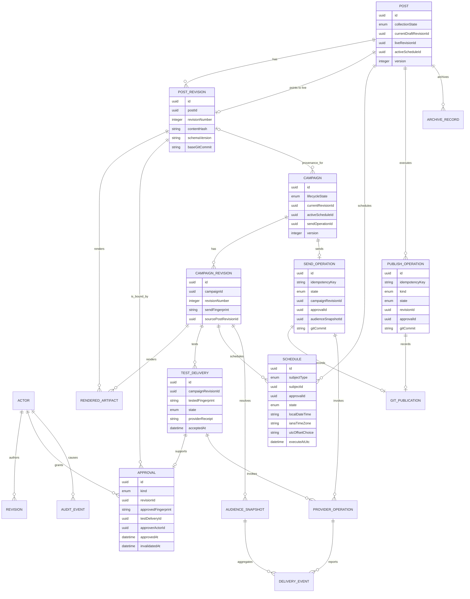
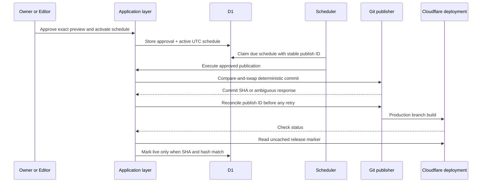
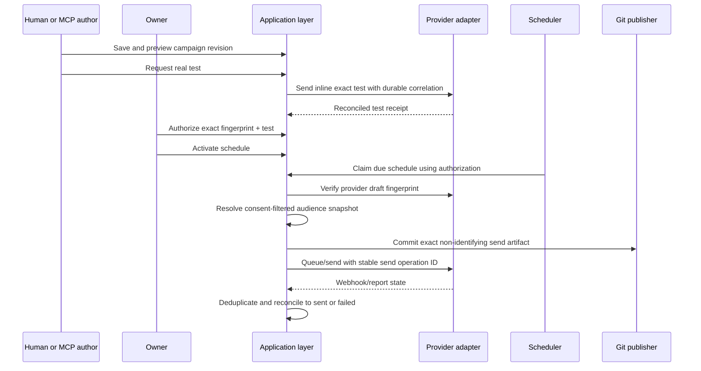

# Blog and newsletter publishing lifecycle

This model resolves
[issue #19](https://github.com/Humber-Foundry/foundry-cms/issues/19). It applies
the [domain language](../../CONTEXT.md), the
[draft/publish pipeline](../decisions/ADR-0004-draft-preview-publish-pipeline.md)
and the
[newsletter adapter boundary](../decisions/ADR-0002-default-newsletter-delivery-adapter.md)
to one application layer used by `/dash`, MCP, scheduled jobs, Git and delivery
providers.

The model is provider- and framework-neutral. D1 is the operational authority;
Git contains deterministic published and dispatched artifacts; the public
release marker proves a post is live; and the delivery provider supplies
external delivery facts.

## Invariants

1. Stable aggregate IDs never encode titles, slugs, email addresses, provider
   IDs or mutable state. All IDs are installation-scoped UUIDs.
2. Revisions, rendered artifacts, approvals, test receipts, audience snapshots
   and audit events are immutable. A change creates a successor.
3. At most one post revision is verified live for a post. A newer draft may
   coexist with it.
4. An approval is usable only while its complete fingerprint equals the current
   execution fingerprint and it has not been revoked, superseded or consumed.
5. A campaign cannot receive bulk-send authorization without a successful real
   test delivery for the same send fingerprint and the Owner's confirmation
   that the delivered message was reviewed.
6. Campaign edits revoke the test and authorization, cancel any pending
   provider work and deactivate the local schedule in one application
   transaction.
7. Only an Owner can activate a campaign schedule or request an immediate bulk
   send. No non-human identity can acquire that capability.
8. The scheduler can execute only a pre-authorized active schedule. It cannot
   create, broaden or repair authorization.
9. A unique execution key identifies one logical publication or send across
   claims, retries, timeouts, webhooks and reconciliation.
10. A negative subscriber state always wins when resolving an audience.
11. Git history is append-only. Unpublish, archive recovery and resend recovery
    use new commits or operations; they never rewrite a prior commit.
12. Every rejected command returns a stable reason code and writes an
    abuse-safe audit event containing no secret, raw token or subscriber list.

## Entity and relationship model



`REVISION` in the diagram is the conceptual parent of `POST_REVISION` and
`CAMPAIGN_REVISION`; it need not be a physical table. Provider IDs are mappings,
never aggregate IDs.

### Entity responsibilities

| Entity | Authority and version rule |
|---|---|
| `Post` | Stable aggregate. Optimistic commands compare and advance `version`. `liveRevisionId` changes only after deployment verification. |
| `PostRevision` | Immutable post snapshot. Its deterministic Markdown hash includes schema-valid fields, stable references and serialization version. |
| `Campaign` | Stable aggregate. V1 permits one completed bulk send; reuse creates a new campaign. |
| `CampaignRevision` | Immutable send-affecting snapshot: subject, preview text, HTML/text source, sender identity, compliance footer version and audience-definition version. |
| `RenderedArtifact` | Exact bytes plus channel, renderer commit, schema version and deterministic artifact fingerprint. |
| `Approval` | Human evidence bound to the relevant fingerprint. It never stores a reusable capability token. |
| `TestDelivery` | Real provider test operation and normalized receipt for explicit non-audience test recipients. Addresses are protected operational data. An Owner's later authorization records that the delivered message was reviewed. |
| `Schedule` | Human-authorized intent with original civil time and a single resolved UTC instant. Proposals are separate and non-executable. |
| `AudienceSnapshot` | Immutable recipient resolution at dispatch. Stores definition version, suppression/consent cut-off, counts and protected recipient references. |
| `PublishOperation` | Idempotent Git/deployment operation for post publish, update, unpublish or archive withdrawal. |
| `SendOperation` | One logical bulk send. A database uniqueness constraint permits only one non-cancelled operation per campaign. |
| `ProviderOperation` | Adapter call, stable idempotency/correlation key, provider mapping, attempt state and reconciliation cursor. |
| `ArchiveRecord` | Who archived what and why, plus the revision/schedule/live pointers needed to explain or restore it. |
| `AuditEvent` | Append-only accepted or rejected domain transition with actor, target, reason code, request ID and non-secret before/after state. |

## Fingerprints and binding

Fingerprints use SHA-256 over length-delimited canonical values with an explicit
format version. Concatenating ambiguous strings is forbidden.

```text
postArtifactFingerprint = sha256(
  "foundry.post-artifact.v1",
  postId,
  postRevisionId,
  contentHash,
  schemaVersion,
  rendererCommit,
  serializationVersion,
  renderedBytesHash
)

campaignSendFingerprint = sha256(
  "foundry.campaign-send.v1",
  campaignId,
  campaignRevisionId,
  subject,
  previewText,
  htmlHash,
  textHash,
  senderIdentityId,
  complianceFooterVersion,
  audienceDefinitionId,
  audienceDefinitionVersion,
  schemaVersion,
  rendererCommit
)

bulkAuthorizationFingerprint = sha256(
  "foundry.bulk-authorization.v1",
  campaignSendFingerprint,
  testDeliveryId,
  testProviderReceiptHash,
  testAcceptedAt
)
```

The server computes fingerprints; clients submit IDs and expected versions, not
trusted hashes. Test recipients and schedule time do not alter campaign content,
but the audit binds both to the authorization. A test request may target only
installation-configured test-recipient actor IDs; agents cannot supply or read
arbitrary addresses. Editing any send-affecting field creates a new campaign
revision and fingerprint. Audience-rule changes count as edits. Changing only
the proposed or active execution time creates a replacement schedule and does
not require another test, provided the authorization remains valid.

## Blog lifecycle

A post has orthogonal state rather than one overloaded status:

- `collectionState`: `active | archiving | archived`
- `liveState`: derived as `never_published | publishing | live |
  unpublishing | publish_failed | unpublish_failed | unpublished`
- current revision workflow: `editing | approval_required | approved |
  scheduled | executing | failed | superseded`

The UI may summarize combinations as “Published with unpublished changes” or
“Archived; withdrawal failed,” but it must retain the exact component states.

### Post transition table

| Command/event | Required state and evidence | Authorized actor | Atomic result | Rejection reason examples |
|---|---|---|---|---|
| Create post | Unique request key and valid schema | Owner, Editor, MCP agent with author scope | Create active post and revision 1 in `editing` | `SCHEMA_INVALID`, `IDEMPOTENCY_CONFLICT` |
| Edit post | Active post, expected aggregate/revision version | Owner, Editor, scoped MCP agent | Create immutable successor revision; supersede prior draft; invalidate its approval and deactivate its schedule | `POST_ARCHIVED`, `REVISION_CONFLICT` |
| Preview post | Persisted revision and compatible renderer/schema | Owner, Editor, scoped MCP agent | Create/read exact rendered artifact; no state authority granted | `RENDERER_MISMATCH`, `REFERENCE_INVALID` |
| Approve post | Canonical artifact fingerprint equals current revision; human has inspected preview | Owner or Editor | Create approval; revision becomes `approved` | `PREVIEW_STALE`, `NON_HUMAN_APPROVAL_FORBIDDEN` |
| Propose schedule | Current revision exists; civil time parses | Owner, Editor, MCP agent | Store non-executable proposal | `LOCAL_TIME_INVALID` |
| Activate schedule | Valid approval for current fingerprint; resolved future instant | Owner, Editor or MCP connection with `publication.schedule` | Replace/deactivate prior schedule; mark revision `scheduled` | `APPROVAL_REQUIRED`, `AMBIGUOUS_LOCAL_TIME` |
| Publish now | Valid approval for current fingerprint | Owner, Editor or MCP connection with `publication.publish` | Create/return one publish operation and start Git pipeline | `APPROVAL_STALE`, `PUBLISH_IN_PROGRESS` |
| Claim due schedule | Active due schedule, valid approval/fingerprint, no competing production operation | System scheduler | Lease schedule and create/return its unique publish operation | `SCHEDULE_INACTIVE`, `APPROVAL_STALE` |
| Git commit accepted | Expected production head and publish ID match | Git integration reporting to application layer | Store commit; operation `building`; never create another commit for retry | `PRODUCTION_HEAD_MOVED`, `GIT_RESULT_AMBIGUOUS` |
| Deployment verified | Release marker equals commit/content hash | Deployment integration | Set `liveRevisionId`; operation `live`; consume schedule | `RELEASE_MARKER_MISMATCH` |
| Publish/build fails | Operation exists | Integration or scheduler | Keep prior `liveRevisionId`; operation `failed`; expose retry/revise actions | `BUILD_FAILED`, `DEPLOYMENT_TIMEOUT` |
| Unpublish | Post currently live; no conflicting publish | Owner or Editor | Cancel schedule; create idempotent removal publication; old revision remains live until verified | `POST_NOT_LIVE`, `PUBLISH_IN_PROGRESS` |
| Unpublish verified | Release marker proves route absent/new content hash | Deployment integration | Clear `liveRevisionId`; set `unpublished` | `RELEASE_MARKER_MISMATCH` |
| Archive | Active post | Owner or Editor | Cancel schedule and approvals. If not live, archive immediately; if live, enter `archiving` and start removal publication | `POST_ALREADY_ARCHIVED` |
| Recover archive withdrawal access | Archiving post, exact archive request and persisted withdrawal workspace | Owner or Editor | Grant the current human collaborator access to review and approve the existing withdrawal draft; append recovery audit | `ARCHIVE_REQUEST_NOT_FOUND`, `HUMAN_AUTHORITY_REQUIRED` |
| Archive withdrawal verified | Archiving post and matching operation | Deployment integration | Clear live pointer; create archive record; set `archived` | `OPERATION_MISMATCH` |
| Restore | Archived post | Owner or Editor | Set active; create new editing revision copied from selected archived revision; remain unpublished | `POST_NOT_ARCHIVED`, `REVISION_NOT_FOUND` |

Editing a live post never changes the serving revision. A failed update leaves
the prior revision live and labels the new operation failed. Retrying a failed
build redeploys the same Git commit; revising content requires a new preview,
approval and later commit.

## Campaign lifecycle

Campaign lifecycle states are:

`draft → test_pending → tested → approved → scheduled → preparing_send →
provider_queued → sending → sent`

Recoverable side states are `test_failed`, `schedule_missed`, `send_failed` and
`cancelled`. An edit before terminal send returns the campaign to `draft`,
invalidates test/authorization and deactivates pending execution. A sent
campaign is immutable; “send again” clones it to a new campaign ID.

### Campaign transition table

| Command/event | Required state and evidence | Authorized actor | Atomic result | Rejection reason examples |
|---|---|---|---|---|
| Create campaign | Valid schema; optional source post revision exists | Owner, Editor, scoped MCP agent | Create standalone or derived campaign revision in `draft`; copy source values once | `SOURCE_REVISION_NOT_FOUND` |
| Edit campaign | Not `sent` or actively dispatching; expected version | Owner, Editor, scoped MCP agent | Create successor revision; invalidate test and approval; deactivate schedule; enqueue provider cancellation if needed | `CAMPAIGN_IMMUTABLE`, `REVISION_CONFLICT` |
| Preview campaign | Persisted current revision | Owner, Editor, scoped MCP agent | Render exact HTML/text and fingerprint | `CAMPAIGN_RENDER_FAILED` |
| Request test | Current rendered artifact; explicit allowed test recipients | Owner, Editor, scoped MCP agent | Create/return test operation; state `test_pending` | `TEST_RECIPIENT_FORBIDDEN`, `PROVIDER_UNHEALTHY` |
| Test accepted | Provider receipt reconciles to current fingerprint | Integration | Store successful receipt; state `tested` | `TEST_FINGERPRINT_MISMATCH` |
| Test fails | Test operation exists | Integration | State `test_failed`; retain failure and retry action | `PROVIDER_TEST_FAILED` |
| Authorize bulk send | Successful current test; exact authorization fingerprint; Owner confirms the delivered test was reviewed | Owner only | Create authorization with review confirmation; state `approved` | `OWNER_REQUIRED`, `TEST_REQUIRED`, `TEST_STALE`, `TEST_NOT_REVIEWED` |
| Propose schedule | Current revision and parseable civil time | Owner, Editor, scoped MCP agent | Store proposal only; no state change to executable schedule | `LOCAL_TIME_INVALID` |
| Activate schedule | Current Owner authorization; resolved future instant | Owner only | Create active schedule bound to authorization; state `scheduled` | `OWNER_REQUIRED`, `AUTHORIZATION_STALE` |
| Send now | Current Owner authorization; no prior send operation | Owner only | Create unique send operation; state `preparing_send` | `OWNER_REQUIRED`, `SEND_ALREADY_EXISTS` |
| Claim due schedule | Active due schedule within lateness policy; current authorization | System scheduler | Lease schedule; create/return unique send operation; state `preparing_send` | `SCHEDULE_MISSED`, `AUTHORIZATION_STALE` |
| Prepare execution | Send operation leased; provider draft fingerprint matches | System scheduler/application service | Resolve audience snapshot, serialize Git artifact, commit once, then permit provider call | `PROVIDER_DRIFT`, `AUDIENCE_EMPTY`, `GIT_COMMIT_FAILED` |
| Provider accepts | Correlated operation and matching provider campaign | Integration | State `provider_queued` or `sending`; store provider ID | `PROVIDER_RESULT_AMBIGUOUS` |
| Provider confirms sent | Verified webhook/report reconciliation | Integration | State `sent`; consume authorization/schedule; retain exact sent artifacts | `PROVIDER_EVIDENCE_MISSING` |
| Provider/send fails | Existing operation | Integration or scheduler | State `send_failed`; retain operation, audience snapshot, Git commit and retry/reconcile actions | `PROVIDER_REJECTED`, `PROVIDER_TIMEOUT` |
| Cancel schedule | Not provider-queued | Owner only | Deactivate local schedule; cancel provider work if present; state returns to `approved` only if authorization remains valid | `OWNER_REQUIRED`, `TOO_LATE_TO_CANCEL` |
| Clone sent campaign | Source campaign is terminal | Owner, Editor, scoped MCP agent | New campaign ID and revision with provenance; state `draft` | `SOURCE_CAMPAIGN_NOT_FOUND` |

The adapter may create or update a provider draft while preparing a bulk send,
but it does not make that draft authoritative. Before bulk dispatch, the
application compares the provider draft fingerprint to the current approved
artifact. Provider UI drift blocks the send and is visible. A campaign test
uses one provider request with inline immutable content and explicit recipients
so a mutable provider draft cannot race the test write.

## Scheduling policy

Every proposal and active schedule stores:

- the user-entered local date and time;
- an IANA time-zone name;
- for an overlapping daylight-saving time, the explicitly selected UTC offset;
- the UTC instant resolved at activation;
- the time-zone database version used for resolution; and
- creator, activator, approval and audit IDs.

A nonexistent spring-forward local time is rejected with the next valid local
times. An ambiguous fall-back time requires the user to choose the first or
second occurrence. Once activated, the stored UTC instant is execution truth;
a later time-zone database change is shown but does not silently move it.
Rescheduling creates a successor schedule and deactivates the old one.

The shared scheduler polls due rows and atomically claims one with a lease and a
unique database constraint on `(scheduleId, scheduledInstant)`. Expired leases
may be reclaimed by the same logical execution ID.

- A late post schedule executes when service returns, records its lateness and
  remains visible until live or failed.
- A campaign no more than 15 minutes late may execute and records its lateness.
- A campaign more than 15 minutes late becomes `schedule_missed`; it never sends
  automatically. The Owner must activate a new schedule or choose Send now,
  using the still-valid authorization if the campaign has not changed.

Cancellation deactivates locally before calling an adapter. A campaign is
reported cancelled only after reconciliation proves it is not queued. If the
provider says it is too late, the CMS shows `cancellation_uncertain` and polls;
it never promises cancellation from a local flag alone.

## Git serialization and commit timing

### Posts

Scheduled posts remain private in D1 until due. At the due instant, the
scheduler uses the existing publication transaction to create one deterministic
Markdown/content commit. The post becomes live only after the build succeeds
and the release marker verifies the exact commit and content hash.

Unpublish and archive withdrawal create new commits that remove the public
route/content while retaining D1 history. Restore creates a new draft and later
publishes as a new commit.

### Campaigns

Tests do not commit to Git. Immediately before the first bulk provider call, the
send operation commits a provider-neutral campaign record containing stable
campaign/revision/send IDs, exact HTML and text artifacts, subject, sender
reference, compliance version, audience-definition version, approval
fingerprint, scheduled instant and non-identifying audience counts. It contains
no subscriber addresses, provider secret or raw consent evidence.

Git failure blocks the provider call. If Git succeeds and delivery fails, retry
reuses the same send operation and commit. A later provider outcome is appended
to D1 and may be represented by a separate deterministic status snapshot
commit, but the approved artifact commit is never amended or rewritten.

## Execution and retry sequences

### Scheduled post



### Campaign test, approval and scheduled send



### Edit invalidation

```mermaid
sequenceDiagram
    participant X as Author
    participant A as Application layer
    participant D as D1
    participant P as Provider adapter

    X->>A: Edit approved or scheduled campaign
    A->>D: Transaction: new revision
    A->>D: Invalidate test and authorization
    A->>D: Deactivate local schedule
    A->>D: Enqueue provider-cancel outbox item
    A-->>X: Draft; test and Owner authorization required
    D->>P: Cancel stale provider work
    P-->>D: Reconciled cancellation or uncertainty
```

### Retry rules

| Boundary | Retry rule |
|---|---|
| D1 command | Idempotency key returns the original result; a different payload with the same key is rejected. |
| Git create/update | Reconcile by publish/send ID and expected parent before retry. Never automatically commit on a newer head. |
| Deployment | Retry deployment of the same commit; do not create a content commit. |
| Provider test | Do not retry an ambiguous provider write. Retain its stable execution and correlation evidence for explicit investigation. |
| Provider bulk send | Never blindly retry an ambiguous response. Poll by provider ID/correlation; retry only when the adapter proves no queue/send exists. |
| Webhook | Verify, deduplicate by provider event ID or deterministic fallback, acknowledge quickly, process asynchronously. |
| Scheduled claim | Lease may be reclaimed only with the same logical operation ID. Database uniqueness prevents a second execution. |

## Permission matrix

`Yes` means the application layer may grant the capability after state and
evidence checks. Adapter credentials cannot call human commands.

| Capability | Owner | Editor | MCP agent | Integration | Scheduler |
|---|---:|---:|---:|---:|---:|
| Create/edit post or campaign draft | Yes | Yes | Scoped | No | No |
| Preview persisted revision | Yes | Yes | Scoped | No | No |
| Approve post preview | Yes | Yes | No | No | No |
| Publish approved post | Yes | Yes | `publication.publish` | No | Execute active approved post schedule only |
| Unpublish/archive/restore post | Yes | Yes | No | No | No |
| Propose post/campaign schedule | Yes | Yes | Yes | No | No |
| Activate/cancel post schedule | Yes | Yes | `publication.schedule` | No | No |
| Request campaign test | Yes | Yes | Yes | Perform requested provider operation only | No |
| Read test recipients/receipt | Yes | Limited to own/authorized test | No addresses | Report normalized result | No |
| Authorize bulk send | Yes | No | No | No | No |
| Activate/cancel campaign schedule | Yes | No | No | No | No |
| Send campaign now | Yes | No | No | No | No |
| Resolve audience identities | Yes via explicit protected action | No | No | Provider-specific minimum only | Service-internal at authorized execution |
| Execute bulk send | No direct adapter bypass; command creates operation | No | No | Perform one requested operation only | Yes, only with active Owner authorization |
| Ingest delivery/bounce/unsubscribe | Read/manage | Aggregate view | Aggregate view | Yes, verified events | Reconcile only |
| Retry failed Git/deployment operation | Yes | Post only | No | Report/redeploy when requested | Same authorized operation only |
| Retry/reconcile failed bulk send | Yes | No | No | Report/reconcile when requested | Same authorized operation only |

The Owner's “Send now” command still goes through the application service,
audience resolution, Git serialization and provider adapter. Possessing a
provider credential is never equivalent to bulk-send authorization.

## User-visible failures

Every failure view shows: affected item and revision, last confirmed state,
whether the old post is still live or the campaign may have queued, stable
reason code, time, retry eligibility and the next authorized action.

| Condition | Truthful presentation | Recovery |
|---|---|---|
| Post build fails | “Update failed; previous revision remains live” or “First publication is not live” | Retry same commit deployment or revise and reapprove |
| Release cannot be verified | “Deployment built; live version unverified” | Continue uncached verification; never mark live early |
| Scheduled post approval invalid | “Schedule paused because revision or renderer changed” | Preview, approve and activate replacement schedule |
| Campaign test fails | “Test not accepted by provider” with safe provider code | Retry test after health correction |
| Campaign edited after approval | “Test and Owner authorization expired; schedule removed” | Retest, reauthorize, reactivate |
| Provider send result ambiguous | “Delivery status uncertain; do not resend” | Reconcile provider state before retry |
| Campaign schedule missed | “Not sent; schedule missed by more than 15 minutes” | Owner reschedules or sends now |
| Archive withdrawal fails | “Archive pending; post remains live” | Retry same removal commit/deployment |
| Cancellation uncertain | “Provider may already have queued this campaign” | Poll/reconcile; block new send operation |

## Worked examples

### Scheduled publication

An Editor saves post revision 7, opens its canonical preview and approves its
artifact. They schedule `2026-11-01 01:30 America/Vancouver` and select the
second occurrence (`-08:00`). The schedule stores that choice and its UTC
instant. At the instant, the scheduler claims the row once, commits revision 7
and waits. The existing revision remains live until the release marker proves
revision 7's commit and hash. A second scheduler poll returns the same publish
operation.

### Invalidated campaign approval

An MCP agent drafts a campaign and requests a successful test. An Owner
authorizes it and activates Tuesday at 09:00. The agent then changes the
call-to-action. One transaction creates a revision, invalidates the test and
authorization, deactivates the schedule and requests provider cancellation.
Tuesday's scheduler sees no active schedule. A new test and Owner authorization
are required.

### Failed delivery

The scheduler commits the approved campaign artifact, resolves 842 eligible
recipients and calls the adapter. The request times out. The operation becomes
`send_failed` with `delivery status uncertain`; no automatic resend occurs.
Reconciliation finds the provider campaign queued under the stored correlation
key, so the same operation advances to `provider_queued` without another Git
commit or provider send.

### Archive and restore

An Editor archives a live post. Its schedule and approval are cancelled and a
new Git removal commit is deployed. Only after the public release marker proves
withdrawal does the item become archived. Months later the Editor restores
revision 4. Foundry creates a new active draft revision with provenance to
revision 4; it is not public until previewed, approved and published as a new
commit.

### Blog-to-campaign reuse

An Editor derives campaign `C` from post revision 12. `C` records
`sourcePostRevisionId=12` and copies the eligible fields into campaign revision
1. Later post revision 13 changes the article title; `C` does not change and its
fingerprint remains stable. The CMS may offer an explicit compare/import action,
but accepting changes creates a new campaign revision and invalidates any test,
authorization and schedule.

## Behavioral acceptance tests

1. **Post schedule executes once:** Given one approved active post schedule,
   when two scheduler workers claim it concurrently, then one publish operation
   exists and at most one Git commit contains its publish ID.
2. **Post edit invalidates approval:** Given an approved scheduled revision,
   when any schema-valid field changes, then a successor revision exists, the
   approval is unusable and no active executable schedule remains.
3. **Live content is truthful:** Given Git accepted a post commit but the
   deployment is unverified, when the post is queried, then the prior live
   revision remains live and the new operation is not reported live.
4. **Late post recovers:** Given an approved post schedule became due during an
   outage, when scheduling resumes, then it executes once and records lateness.
5. **DST gap is rejected:** Given a nonexistent civil time, when schedule
   activation is attempted, then no schedule activates and valid alternatives
   are returned.
6. **DST overlap is explicit:** Given an ambiguous civil time, when no offset
   occurrence is selected, then activation is rejected.
7. **Unpublish preserves history:** Given a live post, when unpublish succeeds,
   then a new removal commit exists, the live pointer clears and all post
   revisions remain recoverable.
8. **Archive is reversible:** Given an archived post, when restored, then a new
   active draft exists and nothing becomes public without a new approval.
9. **Derived campaign is independent:** Given a campaign derived from post
   revision A, when post revision B is created, then campaign content and
   fingerprint do not change.
10. **Preview is not a test:** Given only an on-screen campaign preview, when an
    Owner authorizes bulk send, then the command fails with `TEST_REQUIRED`.
    Given provider acceptance without Owner confirmation that the delivered
    message was reviewed, authorization fails with `TEST_NOT_REVIEWED`.
11. **Test binds exact content:** Given a successful test for fingerprint A,
    when the campaign has fingerprint B, then bulk authorization fails with
    `TEST_STALE`.
12. **Edit removes pending send:** Given an approved scheduled campaign, when
    an author edits a send-affecting field, then test and authorization are
    invalidated, local schedule is inactive and provider cancellation is
    tracked.
13. **Agent cannot activate campaign delivery:** Given a valid MCP credential
    and valid Owner authorization, when the agent requests campaign activation
    or send-now, then
    authorization fails and no schedule/send operation/provider call exists.
14. **Editor cannot authorize bulk:** Given a valid Editor membership and
    successful test, when bulk authorization is requested, then it fails with
    `OWNER_REQUIRED`.
15. **Scheduler cannot invent authority:** Given a due campaign proposal but no
    active Owner-authorized schedule, when the scheduler polls, then no send
    operation exists.
16. **Duplicate bulk send is prevented:** Given an existing send operation,
    when Send now and a scheduled claim race, then one wins the unique
    constraint and all retries return that operation.
17. **Ambiguous provider result is safe:** Given a timed-out provider request,
    when retry processing runs, then it reconciles first and cannot call send
    again until absence of a prior queue/send is proved.
18. **Provider drift blocks dispatch:** Given approved fingerprint A and a
    provider draft with fingerprint B, when dispatch begins, then no audience
    is sent and `PROVIDER_DRIFT` is visible.
19. **Suppression wins:** Given an address was selected before a hard-bounce
    event, when the audience snapshot is finalized, then the address is excluded
    and the negative state is preserved.
20. **Missed campaign is not silently sent:** Given a campaign is more than 15
    minutes late, when the scheduler resumes, then it becomes
    `schedule_missed` and requires a new Owner action.
21. **Git failure blocks email:** Given campaign serialization cannot commit,
    when dispatch runs, then no bulk provider call occurs and the same operation
    remains recoverable.
22. **Failed delivery preserves evidence:** Given Git succeeded and provider
    delivery failed, when the Owner retries, then the same send operation,
    audience snapshot and Git commit are reused.
23. **Rejected transitions are explainable:** Given any rejected command, then
    the response contains a stable reason code and the audit contains actor,
    target, request ID and non-secret current/required state.
24. **No history rewrite:** Given publish, unpublish, archive, restore and
    failed retry operations, then every Git update is non-force and no recovery
    changes an existing commit.
