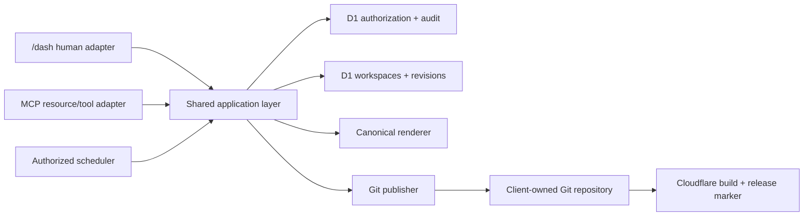

# Production MCP contract

This package resolves
[issue #17](https://github.com/Humber-Foundry/foundry-cms/issues/17).
It defines the first production MCP surface for Foundry CMS. It is a product
contract, not a second backend: every resource and tool adapts the same
application commands, authorization policies, D1 draft model, approval records,
deterministic serializers and Git publisher used by `/dash`.

The contract targets the stable
[MCP 2025-11-25 specification](https://modelcontextprotocol.io/specification/2025-11-25)
and must negotiate that revision or an explicitly tested compatible revision.
Protocol annotations are usability hints, never authorization controls.

## Fixed invariants

1. One MCP connection is one installation-local, non-human actor with one site,
   one grant, independently revocable credentials and no human impersonation.
2. The bearer token audience is the exact site's MCP resource URI. A token for
   another site, the human dashboard, Cloudflare, GitHub or an email provider is
   invalid.
3. MCP can read published content, schemas, controlled design state, drafts and
   aggregate analytics. It can create and edit drafts, prepare campaign
   artifacts, request a controlled campaign test delivery, prepare canonical
   previews, schedule site/blog publication and request publication.
4. MCP cannot approve its own work. Publication executes only against a valid
   human approval bound to the exact persisted revision, content hash, schema
   version and renderer commit.
5. MCP cannot read subscriber identities, raw analytics events, arbitrary SQL,
   secrets or repository files outside schema-controlled content.
6. No MCP tool sends, schedules or authorizes bulk email. A test-delivery tool
   can send one exact campaign revision only to Owner-configured verified test
   recipients; the agent cannot provide or read their addresses.
7. Every mutation requires optimistic concurrency and a stable idempotency key.
   A replay returns the original result; a stale mutation makes no change.
8. Human and MCP publication produce the same deterministic file tree, Git
   commit shape, deployment verification and restoration path.
9. The audit trail joins OAuth client, MCP connection actor, invocation,
   idempotency result, draft revision, human approval, publish operation and Git
   commit without retaining tokens or prompt bodies.
10. Tool and resource output is data, not trusted instruction. Stored content
    cannot expand scopes, select another site or call a tool.

## Package

- [Capability and permission matrix](permission-matrix.md)
- [Resources, prompts, tools and typed examples](catalog.md)
- [Remote authorization, approval and audit sequences](authorization-and-approval.md)
- [Threat model](threat-model.md)
- [Conformance and integration-test plan](conformance.md)
- [Owner connection guide and worked agent example](connection-guide.md)

## Normative language and versioning

`MUST`, `MUST NOT`, `SHOULD` and `MAY` are normative inside this package.
The initial server contract version is `foundry.mcp.v1`. It is returned in
`serverInfo.description`, every structured result's `contractVersion`, and the
audit event. Tool names and required fields are stable within v1. Additive
optional fields are permitted. Removing or changing a field, scope, error
meaning, side effect or approval rule requires a new contract version.

The transport follows
[Streamable HTTP](https://modelcontextprotocol.io/specification/2025-11-25/basic/transports).
Production validates `Origin`, authenticates every request independently of the
MCP session, never uses a session ID as authentication, and supports no public
or unauthenticated tools.

## Shared application boundary

The MCP adapter may validate JSON-RPC, translate typed arguments and shape
structured results. It MUST NOT reimplement domain permissions, draft mutation,
approval validation, serialization, Git publication, scheduling or analytics
queries.

## Explicitly absent from v1

- Arbitrary file, code, component, HTML, CSS, JavaScript or SQL access.
- Subscriber list, address, contact, recipient or message-level access.
- Bulk-email send, campaign schedule, audience expansion or bulk-send
  authorization. The only delivery capability is the controlled test described
  above.
- An MCP approval tool or an approval field on another tool.
- Tool-defined URLs, web fetch, shell execution or provider pass-through.
- Human membership, role, invitation, secret or integration administration.
- Cross-site aggregation or a token that names more than one site.
- Long-running MCP Tasks. V1 tools complete synchronously or return a durable
  operation ID for later status reads; `execution.taskSupport` is `forbidden`.

## Protocol references

- [MCP authorization](https://modelcontextprotocol.io/specification/2025-11-25/basic/authorization)
- [MCP tools and structured output](https://modelcontextprotocol.io/specification/2025-11-25/server/tools)
- [MCP resources](https://modelcontextprotocol.io/specification/2025-11-25/server/resources)
- [MCP prompts](https://modelcontextprotocol.io/specification/2025-11-25/server/prompts)
- [MCP elicitation](https://modelcontextprotocol.io/specification/2025-11-25/client/elicitation)
- [MCP schema reference](https://modelcontextprotocol.io/specification/2025-11-25/schema)
- [MCP security best practices](https://modelcontextprotocol.io/docs/tutorials/security/security_best_practices)
- [OAuth protected resource metadata, RFC 9728](https://www.rfc-editor.org/rfc/rfc9728)
- [OAuth resource indicators, RFC 8707](https://www.rfc-editor.org/rfc/rfc8707)
