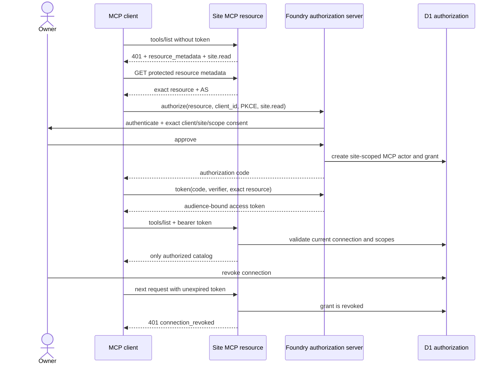
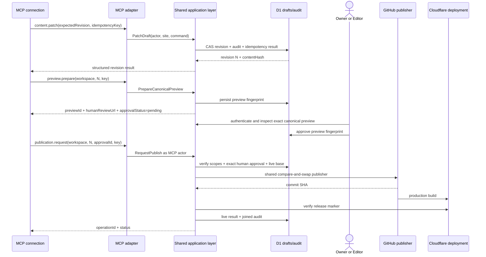

# Authorization, approval and audit

Return to the [contract index](README.md).

## Remote authorization profile

The production endpoint is a site-specific canonical HTTPS resource such as:

```text
https://cms.example.com/api/foundry-mcp
```

The same host may serve multiple installations only when each site has a unique
canonical path and therefore a distinct RFC 8707 resource identifier. A token
cannot name multiple resources.

The server implements MCP's stable 2025-11-25 authorization profile:

- It is an OAuth 2.1 resource server and publishes RFC 9728 protected resource
  metadata.
- Its unauthenticated `401` includes `WWW-Authenticate: Bearer` with
  `resource_metadata` and the initial `site.read` scope. An authenticated call
  that lacks a draft scope returns `403` with
  `error="insufficient_scope"` and a scope value containing `site.read` plus
  exactly the required incremental draft scope.
- The authorization server publishes RFC 8414 or OIDC discovery metadata and
  supports authorization code with PKCE `S256`.
- Clients include the exact `resource` in authorization and token requests.
- The resource server verifies issuer, signature, expiry, not-before, audience,
  resource, client/connection binding and current D1 grant on every request.
- Access tokens are short-lived. Public-client refresh tokens rotate and reuse
  detection revokes the grant.
- Tokens appear only in the `Authorization` header, never a URI, D1 row, log,
  audit event, tool output or downstream request.
- A client token is never forwarded to Cloudflare, GitHub, an email provider or
  analytics provider. Separate installation-owned credentials are resolved
  inside their adapters.

Example protected resource metadata:

```json
{
  "resource": "https://cms.example.com/api/foundry-mcp",
  "authorization_servers": ["https://cms.example.com"],
  "scopes_supported": ["site.read", "content.draft", "design.draft"],
  "bearer_methods_supported": ["header"],
  "resource_name": "Example Site — Foundry CMS"
}
```

The authorization server supports OAuth Client ID Metadata Documents for
compatible clients, pre-registration for major clients that require it, and
Dynamic Client Registration only if a security review and conformance suite
cover it. Redirect URIs use exact matching. Owner consent is stored per site,
user, `client_id`, redirect URI and scope set; an existing consent for one
client never authorizes another.

## Connection and revocation sequence



Tools and templates not allowed by current scopes are omitted from discovery.
Direct calls to omitted tools are still denied. Scope upgrades run a new
authorization request bound to the existing connection ID, a short-lived
signed step-up token and fresh Owner consent; they never happen from a tool
argument. The token response exposes the opaque `connection_id` and
`step_up_token` as extension fields, so a conforming client can initiate
step-up without decoding the access-token JWT. The signed token binds the
access-token identity, actor, client, site, connection, original authorization
redirect URI and exact current scope snapshot. Foundry rejects a missing,
expired, cross-connection, alternate-redirect or stale token before showing or
accepting consent. The consent page names the exact existing connection and
shows both its current and requested permissions. The requested scope set is an
ordered additive superset of the connection's current scopes, so step-up cannot
silently replace, remove, wildcard, or broaden a permission.
The completed authorization issues a replacement token. The client reconnects
and reinitializes with that token before discovering the added tools and
templates; an existing token never gains authority or receives a live
list-change signal. Refresh-token families retain the exact scopes present when
their authorization code was redeemed, so an older family cannot mint a token
with a newly consented scope.

## Preview and publication sequence



`humanReviewUrl` is a same-origin dashboard URL, not a bearer capability. It
contains an opaque preview ID but no token, personal data or approval secret.
The reviewer authenticates through the human boundary. MCP elicitation MAY use
URL mode to help the user navigate to this page, but URL elicitation is
convenience only: it neither authenticates nor records approval. Clients without
elicitation receive the URL as ordinary structured output.
The review route revalidates the stored revision against the current schema,
renderer and production base, then verifies the immutable artifact hash. It
refuses to render after deployment drift.

Approval is immutable and records:

```text
approvalId
siteId
workspaceId
revision
contentHash
schemaVersion
rendererCommit
humanActorId
approvedAt
revokedAt?
```

Any edit, rebase, conflict resolution, schema change, renderer change, base
branch advance, revocation or expiration invalidates it. `publication.request`
cannot accept `approved: true`, reviewer identity or approval evidence supplied
by the client.

For scheduled site/blog publication, the schedule points to the same approval
fingerprint. At execution the scheduler revalidates it and the production base.
If stale, it transitions to `blocked_stale`; it never silently rebases or asks
an agent to approve. Campaign/email artifacts are rejected by the scheduling
command.

## Idempotency and concurrency

Every mutation requires:

```text
idempotencyKey: UUID generated once per logical user intent
expectedRevision: integer for a workspace mutation
```

The server stores `(siteId, actorId, toolName, idempotencyKey)` with a canonical
input hash and result. Behavior:

- Same key and same canonical input returns the original success or terminal
  business error with `replayed: true`.
- Same key with different input returns `IDEMPOTENCY_KEY_REUSED`.
- A lower or different `expectedRevision` returns `STALE_REVISION` plus the latest
  revision and conflict resource URI; it makes no change.
- A timeout is retried with the same key. The server reconciles ambiguous Git
  outcomes by publish ID before attempting a new commit.
- Idempotency records live at least 30 days; publication keys and publish IDs
  live as long as the audit mapping.

Retries for temporary failures use bounded exponential backoff and
`retryAfterMs`. Authorization, validation, stale, approval and scope failures
are not automatically retried.

## Joined audit trail

Each call receives a server `invocationId`. The append-only audit chain uses
stable IDs rather than copied bodies:

```text
oauth_client_id
connection_id -> actor_id -> site_id
invocation_id -> tool_name -> input_hash -> outcome/reason
idempotency_key -> result_hash -> replay_count
workspace_id -> revision -> content_hash
preview_id -> approval_id -> human_actor_id
publish_id -> git_commit_sha -> release_marker
```

Audit records include timestamps, contract/protocol version, scopes evaluated,
object IDs, policy decision, affected revision and safe error code. They exclude
tokens, authorization codes, PKCE values, prompts, model reasoning, raw content,
subscriber data, secrets and full IP addresses. Denials are rate-limited and
abuse-safe. An Owner can export the joined audit from the human dashboard; MCP
can read only the caller's own connection metadata and invocation IDs returned
by its calls.
