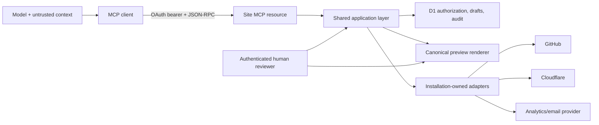

# MCP threat model

Return to the [contract index](README.md).

## Assets and trust boundaries

Protected assets are unpublished content and design state, human approval,
subscriber privacy, aggregate analytics, installation credentials, production
Git authority, public-site integrity and attributable audit history.

The model, prompt text, stored site content, tool output rendered by a client,
client-supplied identifiers and all external provider responses are untrusted.
OAuth verification and application authorization are distinct controls. D1
grant state is authoritative for current MCP permission; Git is authoritative
for published content.

## Threats and controls

| Threat | Attack | Required controls | Observable test/evidence |
|---|---|---|---|
| Confused deputy | A malicious client reuses another client's consent or tricks the authorization server into forwarding authority | Consent bound to user, site, exact `client_id`, redirect URI and scopes; exact redirect matching; PKCE S256; state single-use; client metadata shown; no shared proxy consent | Second client cannot redeem or inherit first client's grant |
| Token passthrough | Client supplies a Cloudflare/GitHub/provider token or server forwards MCP bearer downstream | Exact issuer/audience/resource validation; bearer only in header; no token arguments; separate adapter credentials; secret-field output scans | Foreign-audience tokens fail; downstream capture proves no MCP token |
| Cross-site leakage | Object ID/cursor/token from site A is used at site B | Site-specific resource audience; site derived from principal; composite D1 keys/policies; opaque cursor bound to site and actor; conceal inaccessible existence | Full pairwise site-isolation suite for every resource/tool |
| Prompt/tool injection | Page text, campaign copy, analytics label or provider response tells the model/server to disclose or call tools | Treat content as data; schemas and tool availability come only from server code and grant; no dynamic tool names/descriptions from content; sanitize outputs; allowlisted operations; client confirmation for sensitive actions | Adversarial stored content cannot alter scopes, tool catalog or arguments |
| Replay | Network retry or stolen request repeats a mutation/publish | Required idempotency key; canonical input hash; actor/site/tool binding; durable result; short-lived bearer; refresh rotation; publish reconciliation | Same request returns same IDs; changed body with same key fails |
| Stale write | Concurrent agent/human silently overwrites newer draft | Required `baseRevision`; D1 compare-and-swap; immutable revisions; explicit conflict resource; no automatic last-write-wins | Parallel mutation test yields exactly one new revision |
| Approval substitution | Agent claims approval, swaps revision after review or reuses approval after live renderer changes | Approval created only in human interface; exact fingerprint; approval ID is not sufficient by itself; revalidate hash/schema/renderer/base at execution; one approved artifact kind | Every fingerprint mutation yields `APPROVAL_STALE` and no Git write |
| Privilege escalation | Agent requests broad scope, supplies site/role in input or calls hidden/admin tool | Minimal initial scope; Owner step-up consent; no wildcards; site/actor server-derived; current D1 scope check on every command; omitted tool still denied | Direct hidden-tool calls and forged principal fields fail |
| Subscriber exfiltration | Analytics filters, errors, campaign drafting, a campaign status read or small cells reveal addresses or individuals | Aggregate projection only; fixed views; small-cell suppression; output schema contains no identity fields; a campaign status answers with states, times and one count of people, never the Owner who approved a send, a test address or anyone in the audience; a send-time request carries no person; adapters reject forbidden fields; generic object-not-found | Schema/property tests and seeded canary addresses never appear; every campaign tool's schema is scanned for address-shaped fields |
| Bulk-email execution | Agent turns campaign preparation/test into bulk send/schedule, answers its own send-time request, or triggers provider directly | Only scoped test command; no recipient input; maximum five verified test recipients; no bulk tools/parameters; a send-time request records a proposal and nothing else, and only an Owner turns one into a send through the dashboard, still needing a confirmed test and an approval; declining a request is human-only in both the application and the D1 statement; campaign artifacts rejected by publication scheduler; non-human bulk policy denial | Exhaustive schema scan, test-recipient/rate limits, direct bulk-command denial; a schedule request answers `pending_human_approval` and writes no schedule |
| Arbitrary code/write | Agent uses field names, rich text, design values or an uploaded file to write source/code/CSS | Stable schema IDs; discriminated operations; canonical rich text; controlled tokens/variants; no paths/URLs/HTML/CSS/JS; deterministic serializer owns paths; an uploaded photo's type and size are read from its bytes by the same inspector the dashboard upload uses, the media library stores only JPEG, PNG and WebP, the object key is minted by the server, and the agent never chooses the photo's id or its stored path | Traversal, unknown field, script, CSS escape and oversized payload tests; a non-image payload is refused with `media_not_an_image` |
| Session hijacking | Stolen MCP session ID is treated as identity or injects messages into another user's stream | Authenticate every HTTP request; session not auth; cryptographically random IDs bound to actor; Origin validation; no cross-actor resumable events | Session ID without valid bearer fails; actor mismatch closes session |
| SSRF/open-world abuse | Attacker supplies URL/host or poisons OAuth discovery to reach internal services | No tool accepts URLs, including the photo upload tool, which carries the picture's own bytes rather than an address to fetch; production HTTPS only; server-side OAuth metadata is static/site-owned; clients follow MCP SSRF guidance; adapters use fixed endpoints and egress allowlists | URL-like payloads remain content, not fetch targets; egress tests |
| Tool annotation deception | Client assumes a hint guarantees safety | Accurate static annotations; docs state hints are untrusted; application auth/approval independent; conformance snapshots | Removing/changing annotations does not change server policy |
| Output injection/XSS | Draft content or provider label executes in MCP client/dashboard | JSON structured output; contextual escaping; no raw provider HTML; CSP in dashboard; URLs only in designated typed fields | Script payload round-trips as text and cannot execute |
| Resource exhaustion | Agent enumerates objects, sends huge patches, uploads large pictures or polls analytics/publication aggressively | Page/size/depth limits; quotas per connection/site/tool; bounded range/rows; timeouts; backoff and `Retry-After`; audit denial sampling; the JSON-RPC body limit stays 256 KiB for every request except one `foundry.media.upload` call, which a connection reaches only when it holds `content.draft`, and which is bounded at 6 MiB; the advertised schema bounds the base64 text just above the 4 MiB photo rule, so a picture over the rule is refused with a named reason and a picture far over it is refused by the schema, never decoded | Boundary and sustained-rate tests preserve human operations; an oversized body on any other method is refused with 413 |
| Audit repudiation | Agent action cannot be joined to approval/commit, or logs leak tokens/content | Stable joined IDs and hashes; append-only audit; bot Git commit trailers; redaction; clock discipline; audit write in same D1 transaction as mutation | Trace one scenario end-to-end; secret/canary scan audit exports |
| Revocation lag | Unexpired token remains useful after Owner revokes connection | D1 connection status checked on every command; revoke D1 first; cache only non-authoritative metadata | Previously valid token fails on first post-revocation call |
| Dependency ambiguity | Git accepted commit but response timed out, causing duplicate publish | Durable publish ID, compare-and-swap base, commit trailers, reconcile before retry, one publication lease | Fault injection after Git acceptance yields one commit/build |
| Supply-chain/schema drift | SDK/spec update silently changes validation or tool behavior | Pin SDK; generated schema snapshots; protocol matrix; dependency review; fail closed on unsupported revision | CI diff requires review and supported-version suite passes |
| Registration flood | Anyone who can reach `/api/foundry-mcp/oauth/register` writes registrations until storage or the endpoint is exhausted | 8 KiB body limit; at most 5 redirect URIs; bounded name and URI lengths; 20 registrations per site per hour in `mcp_rate_limit_buckets`; 500 stored clients per site enforced inside the insert statement, which first removes the oldest registrations no Owner approved so a flood cannot lock the site out for good; the hourly budget is spent only on a well-formed registration; operator may set `FOUNDRY_MCP_CLIENTS` to turn registration off | Rate-limited registration returns 429 with `Retry-After` and stores nothing; oversized body and over-long metadata return 400 |
| Registration mistaken for access | A registered client is treated as connected, or an Owner reads a registered name as proof of identity | A registration writes only `mcp_registered_clients`; no connection, actor, scope or token exists until Owner consent behind human sign-in; registered metadata is immutable by database trigger; the name is escaped and the consent screen states it is a claim, beside the client identifier and exact return address | A registered client cannot exchange a token; a script-shaped client name appears escaped and never as markup |
| Consent scope inflation | A consent submission grants a scope the client never requested, or drops a scope a connection already holds | Granted set must be inside the requested set and must keep `site.read`; a step-up must keep every scope the connection already holds; removal still requires revocation | Consent adding an unrequested scope and consent dropping `site.read` are both refused with no connection written |

## Data-flow restrictions

1. The MCP edge converts a verified token into a principal containing stable
   IDs and scopes; raw token claims do not enter domain commands.
2. Input is parsed with size/depth limits, validated against the advertised JSON
   Schema, then validated against current domain schema.
3. The shared application layer authorizes actor, site, capability and object
   state. Route or tool visibility is not authorization.
4. Mutations and their audit/idempotency records commit in one D1 transaction.
5. Adapters receive a domain command and installation-local credential handle,
   never the MCP token or arbitrary endpoint.
6. Output is projected through an allowlist schema, checked for forbidden field
   names and secrets, then returned as structured content.

## Approval abuse cases

- **Agent opens the review URL itself:** reading it cannot approve. The human
  route requires a human Access assertion and application membership.
- **Human clicks approve without reading:** the UI presents exact revision,
  changed documents, design changes, public effect and actor. This is residual
  human risk; high-risk publication cannot be made safe by a hidden checkbox.
- **Client shows a fake confirmation:** client confirmation is not approval
  evidence. Only the server's human approval record is accepted.
- **Approval then schedule far in future:** approval is revalidated at schedule
  execution. Any base or fingerprint drift blocks execution.
- **MCP connection and human belong to same person:** they remain distinct
  actors. A human may approve through `/dash`; the MCP token cannot carry that
  human principal.

## Residual risks and operational controls

- A compromised authorized MCP client can read and mutate everything its scopes
  permit until revocation. Owners should grant only needed scopes, review last
  use and revoke unused connections.
- With dynamic registration on, anyone who can reach the registration endpoint
  can create an inert client record and then send an Owner a link to the consent
  screen. The Owner is the control: the screen names the client, its identifier
  and its exact return address, and states that the name is a claim. An Owner
  who approves a client they did not start has granted that client access. The
  operator can remove this path entirely by setting `FOUNDRY_MCP_CLIENTS`.
- A dynamically registered client may use the `localhost` name in its redirect
  URI, which installed clients such as Claude Code document. A name can be made
  to resolve somewhere other than the Owner's own computer. The Owner sees the
  exact return address on the consent screen. The operator allowlist does not
  accept the name and takes the literal loopback address only.
- A malicious model can produce poor but schema-valid content. Canonical human
  preview and approval are the quality and intent boundary for publication.
- A compromised client-owned Cloudflare or GitHub account exceeds the MCP trust
  boundary. Least-privilege installation credentials, MFA, branch rules,
  rotation and client-owned recovery are required.
- Aggregate analytics can still disclose business-sensitive performance.
  `analytics.read` is separate, optional and auditable.
- Tool annotations and client confirmation UX vary. Server-side denial,
  revision safety and approval do not depend on any one client's interface.

## Incident response

An Owner can revoke one connection without changing human sessions or other MCP
connections. Revocation records actor, time and reason; cancels unclaimed
site/blog schedules created solely by that actor unless an Owner explicitly
adopts them; preserves drafts and attribution; and leaves already-published Git
history intact. Suspected credential theft also rotates/revokes refresh-token
families and searches audit by connection and client ID. Restoration creates a
new reviewed revision and Git commit; history is never rewritten.
